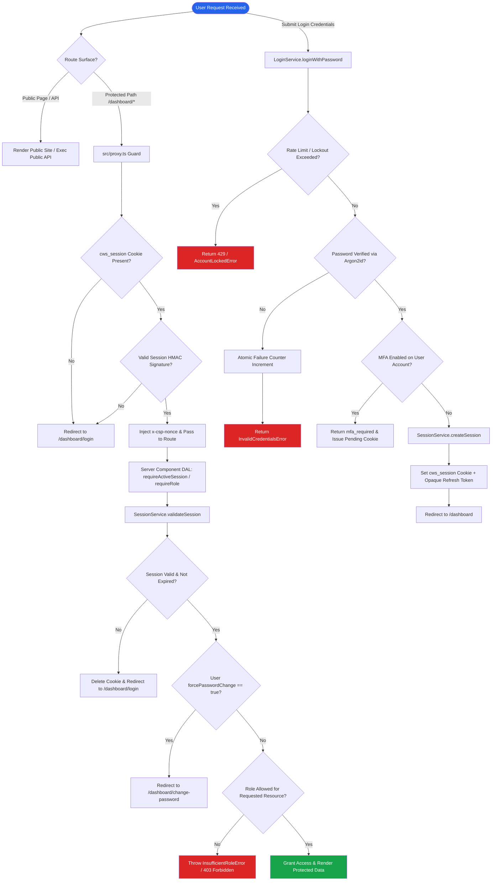
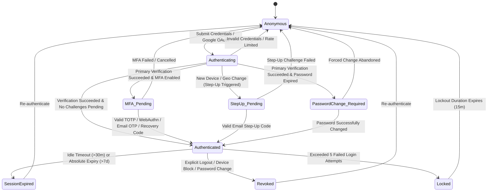

# CWS Next App — System Architecture Documentation Index

**Documentation Generation Date**: 2026-07-22  
**Target Repository**: [cws-next-app](file:///Users/User/Documents/projects/cws-proj/cws-next-app)  
**System Role**: Multi-Surface Web & Mobile Platform (Public Site + Admin Dashboard + Secured Mobile REST API)

---

## Executive Overview

This documentation repository provides a comprehensive, ground-truth audit of the architecture, authentication, database layer, authorization model, Cloudinary media pipeline, and security design of **CWS Next App**.

The project is built on Next.js 16 (App Router) with a custom-engineered, high-assurance authentication engine powered directly by the native MongoDB driver (`mongodb@6.16.0`). It avoids third-party authentication abstractions (such as NextAuth or Auth.js) to maintain strict control over session security, token rotation, multi-factor authentication (MFA), role-based access control (RBAC), and serverless execution semantics.

---

## Primary Technology Stack

| Layer | Technology / Package | Version | Primary Responsibility / File |
| :--- | :--- | :--- | :--- |
| **Framework** | Next.js (App Router) | `16.2.7` | Web application surface, API routes, routing proxy guard ([src/proxy.ts](file:///Users/User/Documents/projects/cws-proj/cws-next-app/src/proxy.ts)) |
| **UI Library** | React | `19.2.4` | Component tree & server rendering |
| **Database** | MongoDB Native Driver | `^6.16.0` | Typed collections, indexes, JSON Schema validation ([src/database/client.ts](file:///Users/User/Documents/projects/cws-proj/cws-next-app/src/database/client.ts)) |
| **Password Hashing**| Argon2id + Pepper | `^0.44.0` | Memory-hard password verification with timing mitigation ([src/auth/crypto/password.ts](file:///Users/User/Documents/projects/cws-proj/cws-next-app/src/auth/crypto/password.ts)) |
| **Web Sessions** | HMAC-SHA256 Signed Cookies| Native `crypto` | Tamper-proof session pointers (`cws_session`) ([src/auth/crypto/token.ts](file:///Users/User/Documents/projects/cws-proj/cws-next-app/src/auth/crypto/token.ts)) |
| **Mobile Auth** | JOSE (EdDSA / Ed25519 JWT) | `^6.2.3` | Asymmetric JWT access tokens + opaque refresh tokens ([src/auth/services/mobile-token.service.ts](file:///Users/User/Documents/projects/cws-proj/cws-next-app/src/auth/services/mobile-token.service.ts)) |
| **MFA & Passkeys** | SimpleWebAuthn / OTPLib | `^13.3.0` / `^13.4.1`| WebAuthn / Passkeys, TOTP authenticators, Email OTP ([src/auth/services/mfa.service.ts](file:///Users/User/Documents/projects/cws-proj/cws-next-app/src/auth/services/mfa.service.ts)) |
| **OAuth 2.0** | Custom OIDC + PKCE | Native `crypto` + `fetch` | Google OAuth code exchange, state/nonce validation, JWKS signature check ([src/auth/services/oauth.service.ts](file:///Users/User/Documents/projects/cws-proj/cws-next-app/src/auth/services/oauth.service.ts)) |
| **Media Storage** | Cloudinary Node SDK | `^2.10.0` | Admin CMS catalog & section media upload stream ([src/lib/cloudinary.ts](file:///Users/User/Documents/projects/cws-proj/cws-next-app/src/lib/cloudinary.ts)) |
| **Validation** | Zod + zod-openapi | `^4.4.3` | Input payload validation and OpenAPI schema generation ([src/auth/validation/admin.schema.ts](file:///Users/User/Documents/projects/cws-proj/cws-next-app/src/auth/validation/admin.schema.ts)) |

---

## Architectural Summaries

### 1. Authentication Approach
- **Identity & Provisioning**: Fixed-user / provisioned accounts only. No public user registration. Accounts are provisioned by system administrators ([src/auth/services/admin.service.ts](file:///Users/User/Documents/projects/cws-proj/cws-next-app/src/auth/services/admin.service.ts)).
- **Web Session Management**: Multi-tier strategy using short-lived access sessions (15-min TTL), rolling idle timeouts (30-min TTL), and rotating refresh tokens (7-day absolute TTL). Refresh token rotation features atomic replacement (`atomicReplace`) and reuse detection to protect against token theft.
- **Mobile Session Management**: Dual-token pattern using short-lived EdDSA signed JWT access tokens and opaque server-side refresh tokens ([src/app/api/mobile/v1/auth/refresh/route.ts](file:///Users/User/Documents/projects/cws-proj/cws-next-app/src/app/api/mobile/v1/auth/refresh/route.ts)).
- **OAuth Governance**: Google OAuth uses PKCE and RS256 JWKS verification. Auto-registration and auto-linking by email are explicitly disabled to prevent account takeover; logins require a pre-provisioned entry in the `oauth_accounts` collection.

### 2. Database Approach
- **Native Driver Integration**: Uses a singleton MongoDB client connection ([src/database/client.ts](file:///Users/User/Documents/projects/cws-proj/cws-next-app/src/database/client.ts)) with collection name constants ([src/database/constants.ts](file:///Users/User/Documents/projects/cws-proj/cws-next-app/src/database/constants.ts)).
- **Schema Enforcement**: Schema validation is enforced at the database level using `$jsonSchema` strict validation rules across 21 collections ([src/database/schemas/index.ts](file:///Users/User/Documents/projects/cws-proj/cws-next-app/src/database/schemas/index.ts)).
- **Indexes & Lifecycle**: Automated index initialization ([src/database/indexes/index.ts](file:///Users/User/Documents/projects/cws-proj/cws-next-app/src/database/indexes/index.ts)) including unique constraints and TTL indexes for session/token cleanup.

### 3. Cloudinary Usage
- **Server-Side Stream Uploads**: Media files uploaded by admin users in CMS features (categories, products, section copy) pass through server validation before being streamed directly to Cloudinary (`cws_categories`, `cws_products`, `cws_sections`).
- **Authorization Scoping**: All Cloudinary upload paths require server-side authorization (`requireRole('admin')`) in [src/auth/dal.ts](file:///Users/User/Documents/projects/cws-proj/cws-next-app/src/auth/dal.ts).

---

## Documentation Directory Map

Click any document link below to open the complete, dedicated architectural deep dive:

1. 📘 [Authentication Overview](file:///Users/User/Documents/projects/cws-proj/cws-next-app/docs/architecture/authentication-overview.md)  
   *Complete component inventory, cookie specs, token definitions, crypto parameters, and code file dependency maps.*

2. 🔄 [Authentication Workflows](file:///Users/User/Documents/projects/cws-proj/cws-next-app/docs/architecture/authentication-workflows.md)  
   *12 detailed step-by-step authentication flows complete with individual Mermaid sequence diagrams.*

3. 🚦 [Authentication Situation Matrix](file:///Users/User/Documents/projects/cws-proj/cws-next-app/docs/architecture/authentication-scenarios.md)  
   *Comprehensive decision matrix detailing exact application behavior across 40+ credential, session, route, OAuth, and infrastructure conditions.*

4. 🛡️ [Authorization & Route Protection](file:///Users/User/Documents/projects/cws-proj/cws-next-app/docs/architecture/authorization-and-route-protection.md)  
   *Role-based access control (RBAC), multi-layer defense-in-depth, security proxy guards, and complete route matrix.*

5. 🗄️ [MongoDB Database Structure](file:///Users/User/Documents/projects/cws-proj/cws-next-app/docs/architecture/database-structure.md)  
   *Collection inventory, detailed field schemas, index rules, Entity-Relationship Diagram (ERD), and sanitized sample JSON documents.*

6. 🖼️ [Cloudinary User Assets](file:///Users/User/Documents/projects/cws-proj/cws-next-app/docs/architecture/cloudinary-user-assets.md)  
   *Admin asset upload workflows, security scoping, sequence diagrams, failure modes, and consistency matrix.*

7. 🔬 [Security Findings & Recommendations](file:///Users/User/Documents/projects/cws-proj/cws-next-app/docs/architecture/security-findings.md)  
   *Audited vulnerabilities (Critical, High, Medium, Low), exploitation scenarios, remediation plan, and prioritized roadmap.*

---

## "Start Here": Developer Onboarding & Request Lifecycle Guide

If you are a developer or security reviewer inspecting this application for the first time, follow this request execution path:

```text
Browser / Mobile Request
       │
       ▼
┌────────────────────────────────────────────────────────┐
│ 1. Next.js Routing Proxy Guard (src/proxy.ts)          │
│    • Checks cws_session cookie signature               │
│    • Generates x-csp-nonce for Content-Security-Policy │
│    • Optimistically redirects unauthenticated requests │
└────────────────────────┬───────────────────────────────┘
                         │
                         ▼
┌────────────────────────────────────────────────────────┐
│ 2. Server Component / Route Handler / Server Action    │
│    • Calls Data Access Layer (src/auth/dal.ts)         │
│    • requireActiveSession() or requireRole('admin')    │
└────────────────────────┬───────────────────────────────┘
                         │
                         ▼
┌────────────────────────────────────────────────────────┐
│ 3. Core Business Services (src/auth/services/*)        │
│    • LoginService, SessionService, OAuthService, etc. │
│    • Evaluates MFA, password policies, device step-up  │
└────────────────────────┬───────────────────────────────┘
                         │
                         ▼
┌────────────────────────────────────────────────────────┐
│ 4. MongoDB Repositories (src/auth/repositories/*)      │
│    • Atomic DB operations, rate limits, audit logs    │
└────────────────────────────────────────────────────────┘
```

---

## Master Visual Authentication Map

The flowchart below traces the high-level decision path taken by the system when a user interacts with public pages, protected dashboard routes, login endpoints, OAuth flows, and administrative actions:



---

## User Authentication State Machine

The following state diagram depicts the valid lifecycle states of a user account and session within the CWS Next App ecosystem:



---

## Scope & Documentation Limitations

1. **Confirmed Code Base**: All details documented across these files are based strictly on code in `src/`, `scripts/`, `next.config.ts`, `package.json`, and `.openapi/openapi.json`.
2. **Third-Party External Services**: Google OAuth OIDC endpoint behavior and Cloudinary API execution are documented based on their SDK integration contracts in the codebase.
3. **Environment Secrets**: Real production credentials, API secrets, and private keys are **never** included. Environment variable names are strictly documented with sanitized descriptions.
