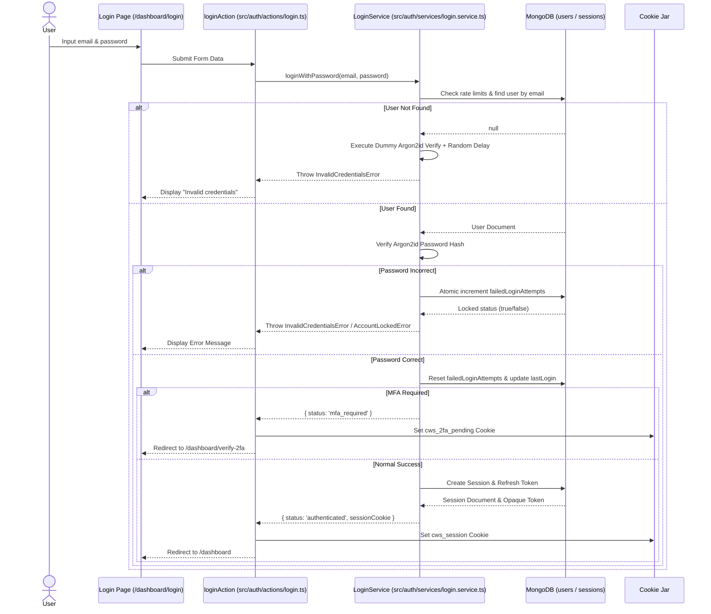
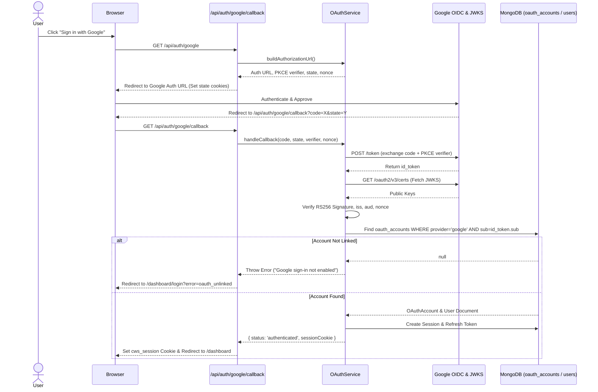
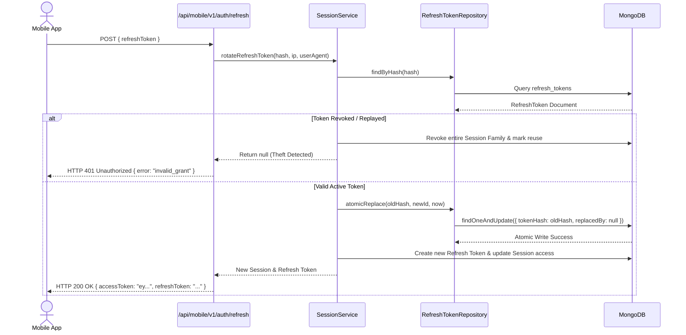
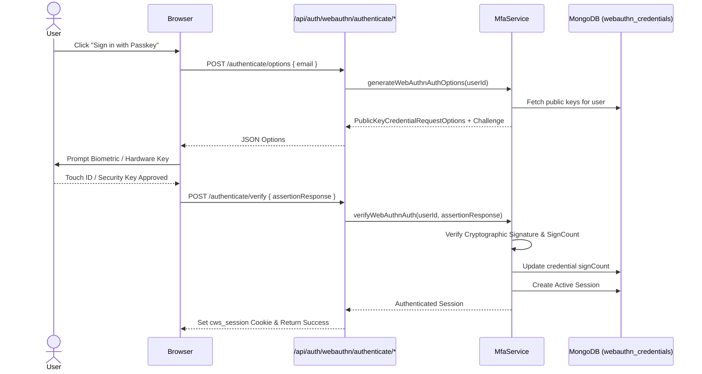
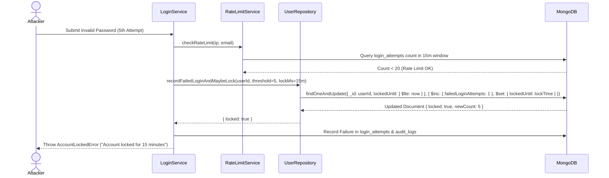

# Complete Authentication Workflows

**Document Path**: `/docs/architecture/authentication-workflows.md`  
**Related Documents**: [Architecture Index](file:///Users/User/Documents/projects/cws-proj/cws-next-app/docs/architecture/README.md) | [Authentication Overview](file:///Users/User/Documents/projects/cws-proj/cws-next-app/docs/architecture/authentication-overview.md) | [Situation Matrix](file:///Users/User/Documents/projects/cws-proj/cws-next-app/docs/architecture/authentication-scenarios.md)

---

## 1. Workflow Summary Table

| Workflow Name | Implemented Status | Primary Entry Point | Success Result | Failure Result | Main Controlling Files |
| :--- | :--- | :--- | :--- | :--- | :--- |
| **Password Login (Web)** | Implemented | `/dashboard/login` (`loginAction`) | Cookie `cws_session` set, redirect to `/dashboard` | Error message returned to UI, login attempt logged | [src/auth/actions/login.ts](file:///Users/User/Documents/projects/cws-proj/cws-next-app/src/auth/actions/login.ts) [src/auth/services/login.service.ts](file:///Users/User/Documents/projects/cws-proj/cws-next-app/src/auth/services/login.service.ts) |
| **Password Login (Mobile)**| Implemented | `/api/mobile/v1/auth/password` | JSON with EdDSA JWT access token & opaque refresh token | HTTP 401 / 429 JSON response | [src/app/api/mobile/v1/auth/password/route.ts](file:///Users/User/Documents/projects/cws-proj/cws-next-app/src/app/api/mobile/v1/auth/password/route.ts) [src/auth/services/mobile-auth.service.ts](file:///Users/User/Documents/projects/cws-proj/cws-next-app/src/auth/services/mobile-auth.service.ts) |
| **Google OAuth 2.0 Login** | Implemented | `/api/auth/google` & `/api/auth/google/callback` | OAuth account matched, `cws_session` cookie set, redirect | Redirect to `/dashboard/login?error=...` | [src/app/api/auth/google/callback/route.ts](file:///Users/User/Documents/projects/cws-proj/cws-next-app/src/app/api/auth/google/callback/route.ts) [src/auth/services/oauth.service.ts](file:///Users/User/Documents/projects/cws-proj/cws-next-app/src/auth/services/oauth.service.ts) |
| **Mobile Token Refresh** | Implemented | `/api/mobile/v1/auth/refresh` | New EdDSA JWT access token & new refresh token | HTTP 401 Unauthorized | [src/app/api/mobile/v1/auth/refresh/route.ts](file:///Users/User/Documents/projects/cws-proj/cws-next-app/src/app/api/mobile/v1/auth/refresh/route.ts) [src/auth/services/session.service.ts](file:///Users/User/Documents/projects/cws-proj/cws-next-app/src/auth/services/session.service.ts) |
| **WebAuthn Passkey Login** | Implemented | `/api/auth/webauthn/authenticate/verify` | Passkey signature verified, `cws_session` cookie set | HTTP 400 / 401 JSON error | [src/app/api/auth/webauthn/authenticate/verify/route.ts](file:///Users/User/Documents/projects/cws-proj/cws-next-app/src/app/api/auth/webauthn/authenticate/verify/route.ts) [src/auth/services/mfa.service.ts](file:///Users/User/Documents/projects/cws-proj/cws-next-app/src/auth/services/mfa.service.ts) |
| **TOTP Authenticator MFA** | Implemented | `/dashboard/verify-2fa` (`verifyTotpAction`) | 6-digit TOTP validated, `cws_session` issued | Error message on 2FA form | [src/auth/actions/verify-totp.ts](file:///Users/User/Documents/projects/cws-proj/cws-next-app/src/auth/actions/verify-totp.ts) [src/auth/services/mfa.service.ts](file:///Users/User/Documents/projects/cws-proj/cws-next-app/src/auth/services/mfa.service.ts) |
| **Email OTP Step-Up 2FA** | Implemented | `/dashboard/verify-2fa` (`verify2faAction`) | 6-digit email code verified, `cws_session` issued | Error message on 2FA form | [src/auth/actions/verify-2fa.ts](file:///Users/User/Documents/projects/cws-proj/cws-next-app/src/auth/actions/verify-2fa.ts) [src/auth/services/two-factor.service.ts](file:///Users/User/Documents/projects/cws-proj/cws-next-app/src/auth/services/two-factor.service.ts) |
| **Recovery Code Login** | Implemented | `/dashboard/verify-2fa` (`verify2faAction`) | 8-digit recovery code consumed, session granted | Error message on 2FA form | [src/auth/actions/recovery-codes.ts](file:///Users/User/Documents/projects/cws-proj/cws-next-app/src/auth/actions/recovery-codes.ts) [src/auth/services/mfa.service.ts](file:///Users/User/Documents/projects/cws-proj/cws-next-app/src/auth/services/mfa.service.ts) |
| **Forced Password Change** | Implemented | `/dashboard/change-password` | Password updated in DB, force flag cleared | Form error, password rejected by policy | [src/auth/actions/change-password.ts](file:///Users/User/Documents/projects/cws-proj/cws-next-app/src/auth/actions/change-password.ts) [src/auth/services/password.service.ts](file:///Users/User/Documents/projects/cws-proj/cws-next-app/src/auth/services/password.service.ts) |
| **Password Reset (Token)** | Implemented | `/dashboard/forgot-password` & `/dashboard/reset-password` | Reset token sent via email, new password hashed | Invalid/expired reset token error | [src/auth/actions/password-reset.ts](file:///Users/User/Documents/projects/cws-proj/cws-next-app/src/auth/actions/password-reset.ts) [src/auth/services/password.service.ts](file:///Users/User/Documents/projects/cws-proj/cws-next-app/src/auth/services/password.service.ts) |
| **Web Session Logout** | Implemented | `/api/auth/logout` | Session revoked in DB, `cws_session` cookie cleared | Redirect to `/dashboard/login` | [src/app/api/auth/logout/route.ts](file:///Users/User/Documents/projects/cws-proj/cws-next-app/src/app/api/auth/logout/route.ts) [src/auth/services/logout.service.ts](file:///Users/User/Documents/projects/cws-proj/cws-next-app/src/auth/services/logout.service.ts) |
| **Account Lockout Trigger**| Implemented | Login failures hit 5 attempts | `lockedUntil` timestamp set to +15m in DB | `AccountLockedError` returned | [src/auth/repositories/user.repository.ts](file:///Users/User/Documents/projects/cws-proj/cws-next-app/src/auth/repositories/user.repository.ts) [src/auth/services/login.service.ts](file:///Users/User/Documents/projects/cws-proj/cws-next-app/src/auth/services/login.service.ts) |

---

## 2. Detailed Workflows & Sequence Diagrams

### Workflow 1: Password Login (Web Surface)

1. **Purpose**: Authenticates a user using email and password, handling lockout checks, MFA requirements, password expiry, and session issuance.
2. **Entry Point**: UI form submission at `/dashboard/login` invoking `loginAction` ([src/auth/actions/login.ts](file:///Users/User/Documents/projects/cws-proj/cws-next-app/src/auth/actions/login.ts)).
3. **Preconditions**: User must have a pre-provisioned active account in `users` and `user_emails`.
4. **Steps**:
   - `loginAction` validates inputs using `loginSchema`.
   - `LoginService.loginWithPassword()` checks sliding window rate limit via `RateLimitService`.
   - User document is resolved via `user_emails`. If unknown, timing-side-channel mitigation executes (dummy Argon2id verify + 0-50ms randomized delay) before throwing `InvalidCredentialsError`.
   - Checks user status (`active`), account lock (`lockedUntil`), and password existence.
   - Verifies Argon2id password hash using `verifyPassword()`. If mismatched, calls `recordFailedLoginAndMaybeLock()` atomically. If 5 failures hit, account locks for 15 minutes.
   - If MFA enabled, returns status `mfa_required`, sets `cws_2fa_pending` cookie, and redirects to `/dashboard/verify-2fa`.
   - If password expired, sets `cws_pw_pending` cookie, and redirects to `/dashboard/change-password`.
   - On full success, calls `SessionService.createSession()`, sets `cws_session` cookie, logs audit entry (`auth.login.success`), and redirects to `/dashboard`.

---

### Workflow 2: Google OAuth 2.0 Login (PKCE & Pre-provisioned Linking)

1. **Purpose**: Secure OIDC sign-in via Google with PKCE, CSRF state protection, and nonce verification.
2. **Entry Point**: Direct navigation to `/api/auth/google`. Callback handled at `/api/auth/google/callback`.
3. **Preconditions**: Google OAuth client ID/secret configured in environment; user MUST have a pre-existing `oauth_accounts` record linked to their account.
4. **Steps**:
   - `/api/auth/google` calls `OAuthService.buildAuthorizationUrl()`, generating random `state`, `codeVerifier`, and `nonce`.
   - Stores `state`, `codeVerifier`, and `nonce` in temporary HttpOnly cookies (`cws_oauth_state`, `cws_oauth_verifier`, `cws_oauth_nonce`).
   - Redirects browser to Google's Authorization endpoint with `code_challenge` (S256).
   - User grants permission at Google. Google redirects back to `/api/auth/google/callback?code=...&state=...`.
   - Callback handler compares query `state` against cookie `cws_oauth_state`.
   - Calls `OAuthService.handleCallback()`, exchanging authorization code for tokens at Google's token endpoint.
   - Fetches Google's JWKS (`https://www.googleapis.com/oauth2/v3/certs`) and verifies `id_token` signature (RS256), `iss`, `aud`, `exp`, and `nonce`.
   - Queries `oauth_accounts` repository by provider `google` and `sub`. If no row exists, fails immediately with an error (auto-linking and public registration disabled).
   - Verifies internal user account status (`active`).
   - Calls `SessionService.createSession()`, sets `cws_session` cookie, and redirects to `/dashboard`.

---

### Workflow 3: Mobile REST API Bearer Authentication & Token Refresh

1. **Purpose**: Grants mobile clients short-lived EdDSA (Ed25519) access JWTs and handles token rotation using opaque refresh tokens.
2. **Entry Point**: `POST /api/mobile/v1/auth/password` for initial login, and `POST /api/mobile/v1/auth/refresh` for token renewal.
3. **Preconditions**: `MOBILE_JWT_PRIVATE_KEY_B64` and `MOBILE_JWT_KEY_ID` configured in environment.
4. **Steps**:
   - Mobile app submits JSON credentials `{ email, password }` to `/api/mobile/v1/auth/password`.
   - `MobileAuthService` verifies password and creates session in `sessions` with `platform: 'mobile'`.
   - Mints asymmetric EdDSA JWT access token (`MobileTokenService.issueAccessToken()`) with key ID `kid` and short TTL (15 minutes).
   - Generates opaque 256-bit refresh token, saves SHA-256 hash in `refresh_tokens`. Returns both tokens in JSON.
   - When access token expires, mobile app posts `{ refreshToken }` to `/api/mobile/v1/auth/refresh`.
   - `SessionService.rotateRefreshToken()` looks up token hash in DB.
   - Checks if token was already revoked. If revoked token is replayed, flags `reuseDetected: true`, revokes the entire session family, emits security alert, and returns HTTP 401.
   - Executes atomic replacement (`atomicReplace`) in MongoDB to prevent race conditions.
   - Mints a new EdDSA JWT access token and new refresh token, returning them to the client.

---

### Workflow 4: WebAuthn / Passkey Authentication

1. **Purpose**: Enables passwordless or 2FA login using browser-native FIDO2 / WebAuthn credentials (TouchID, FaceID, YubiKey).
2. **Entry Point**: `POST /api/auth/webauthn/authenticate/options` followed by `POST /api/auth/webauthn/authenticate/verify`.
3. **Steps**:
   - Client requests authentication options. `/options` handler calls `MfaService.generateWebAuthnAuthOptions()`.
   - Server fetches registered WebAuthn credentials from `webauthn_credentials` collection, generates random challenge, stores challenge in `otp_codes` collection with 5-minute TTL, and returns JSON options to browser.
   - Browser calls `@simplewebauthn/browser` `startAuthentication()`, prompting user for biometric/hardware key touch.
   - Browser posts assertion response to `/verify`.
   - Server verifies assertion signature against stored public key using `@simplewebauthn/server` `verifyAuthenticationResponse()`.
   - Verifies counter to detect cloned authenticators.
   - Creates authenticated session, sets `cws_session` cookie, and returns `{ success: true }`.

---

### Workflow 5: Account Lockout & Brute-Force Rate Limiting

1. **Purpose**: Protects password authentication endpoints against brute-force attacks via sliding window rate limiting and atomic lockout thresholds.
2. **Controlling Logic**: `RateLimitService` ([src/auth/services/rate-limit.service.ts](file:///Users/User/Documents/projects/cws-proj/cws-next-app/src/auth/services/rate-limit.service.ts)) & `UserRepository.recordFailedLoginAndMaybeLock()` ([src/auth/repositories/user.repository.ts](file:///Users/User/Documents/projects/cws-proj/cws-next-app/src/auth/repositories/user.repository.ts)).
3. **Thresholds**:
   - **IP Rate Limit**: 20 failed attempts per IP address within 15 minutes (stored in `login_attempts`).
   - **Account Lockout**: 5 consecutive failed password attempts on a specific account trigger a 15-minute account lock (`lockedUntil = now + 15m`).
4. **Atomic Decision Execution**: Failure counter increment and lock application occur in a single atomic MongoDB `findOneAndUpdate` query. This eliminates race conditions where two concurrent requests could bypass the lockout filter.

