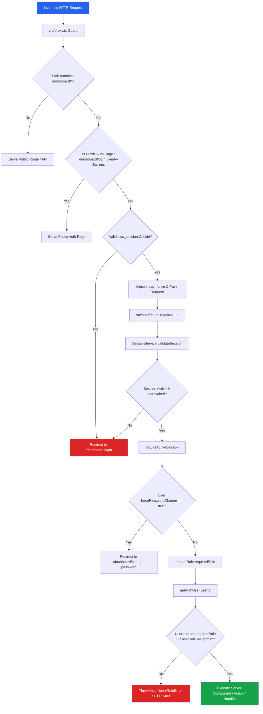

# Authorization and Route Protection Model

**Document Path**: `/docs/architecture/authorization-and-route-protection.md`  
**Related Documents**: [Architecture Index](file:///Users/User/Documents/projects/cws-proj/cws-next-app/docs/architecture/README.md) | [Authentication Overview](file:///Users/User/Documents/projects/cws-proj/cws-next-app/docs/architecture/authentication-overview.md) | [Security Findings](file:///Users/User/Documents/projects/cws-proj/cws-next-app/docs/architecture/security-findings.md)

---

## 1. Access-Control Model

CWS Next App uses a single-string **Role-Based Access Control (RBAC)** architecture.

### Key Architectural Principles:
1. **Single Source of Truth**: The user's role is defined by the string field `users.role` in MongoDB ([src/database/schemas/users.schema.ts](file:///Users/User/Documents/projects/cws-proj/cws-next-app/src/database/schemas/users.schema.ts)).
2. **Supported Roles**:
   - `admin`: Complete access to all application surfaces, CMS management, user management, and API routes. `admin` is always sufficient for any role requirement.
   - `member`: Access to authenticated user dashboard features, profile updates, and device management.
   - `viewer`: Read-only access to authorized administrative interfaces.
3. **No Roles / Permissions Collection**: There is no separate `roles` or `permissions` collection in MongoDB. Capability checks are evaluated directly against the `users.role` string.
4. **Single Enforcement Point**: Role checks are enforced server-side using `requireRole(requiredRole)` in the Data Access Layer ([src/auth/dal.ts](file:///Users/User/Documents/projects/cws-proj/cws-next-app/src/auth/dal.ts)).

---

## 2. Authorization Logic Flowchart

The flowchart below demonstrates how incoming requests move through the proxy guard, authentication checks, active status checks, and role assertions before accessing a protected route:



---

## 3. Complete Route Inventory & Access Matrix

The matrix below documents every page route, route handler, and server action across the application, specifying its protection level, location, and unauthenticated behavior:

| Route / Entry Point | Type | Public / Protected | Required Role | Protection Location | Unauthenticated Behavior |
| :--- | :--- | :--- | :--- | :--- | :--- |
| `/` | Page (Site) | Public | None | None | Renders landing page |
| `/products` | Page (Site) | Public | None | None | Renders product catalog |
| `/categories` | Page (Site) | Public | None | None | Renders categories list |
| `/contact` | Page (Site) | Public | None | None | Renders contact form |
| `/dashboard` | Page (Admin) | Protected | `member` | `requireActiveSession()` in [src/app/(admin)/dashboard/layout.tsx](file:///Users/User/Documents/projects/cws-proj/cws-next-app/src/app/(admin)/dashboard/layout.tsx) | Redirect to `/dashboard/login` |
| `/dashboard/login` | Page (Admin) | Public (Auth) | None | `src/proxy.ts` allowlist | Renders login UI |
| `/dashboard/verify-2fa` | Page (Admin) | Public (Auth) | None | `src/proxy.ts` allowlist | Renders 2FA verification UI |
| `/dashboard/change-password` | Page (Admin) | Public (Auth) | None | `src/proxy.ts` allowlist | Renders force password change UI |
| `/dashboard/forgot-password` | Page (Admin) | Public (Auth) | None | `src/proxy.ts` allowlist | Renders forgot password UI |
| `/dashboard/reset-password` | Page (Admin) | Public (Auth) | None | `src/proxy.ts` allowlist | Renders reset password UI |
| `/dashboard/admin/users` | Page (Admin) | Protected | `admin` | `requireRole('admin')` in [src/app/(admin)/dashboard/admin/users/page.tsx](file:///Users/User/Documents/projects/cws-proj/cws-next-app/src/app/(admin)/dashboard/admin/users/page.tsx) | Redirect to `/dashboard/login` |
| `/dashboard/categories` | Page (Admin) | Protected | `admin` | `requireRole('admin')` in category pages | Redirect to `/dashboard/login` |
| `/dashboard/products` | Page (Admin) | Protected | `admin` | `requireRole('admin')` in product pages | Redirect to `/dashboard/login` |
| `/dashboard/page-content` | Page (Admin) | Protected | `admin` | `requireRole('admin')` in section page | Redirect to `/dashboard/login` |
| `/dashboard/security` | Page (Admin) | Protected | `member` | `requireActiveSession()` in security page | Redirect to `/dashboard/login` |
| `/dashboard/sessions` | Page (Admin) | Protected | `member` | `requireActiveSession()` in sessions page | Redirect to `/dashboard/login` |
| `/api/auth/google` | Route Handler | Public | None | None | Redirects to Google OIDC |
| `/api/auth/google/callback` | Route Handler | Public | None | `state` cookie validation | Exchanges code & sets cookie |
| `/api/auth/logout` | Route Handler | Protected | `member` | `getAuthSession()` | Revokes session & clears cookie |
| `/api/auth/refresh` | Route Handler | Public/Cookie | None | Session cookie / refresh token verification | Rotates tokens & updates cookie |
| `/api/auth/webauthn/*` | Route Handler | Protected | `member` | `requireAuth()` / session verification | Returns HTTP 401 JSON |
| `/api/mobile/v1/auth/*` | REST Route | Public/Token | None | Token / payload verification | Returns HTTP 401 JSON |
| `/api/mobile/v1/admin/*` | REST Route | Protected | `admin` | `verifyMobileAuth()` & `requireRole('admin')` | Returns HTTP 401 / 403 JSON |
| `loginAction` | Server Action | Public | None | `loginSchema` validation | Returns error state |
| `createUserAction` | Server Action | Protected | `admin` | `requireRole('admin')` in action | Throws `InsufficientRoleError` |
| `updateUserAction` | Server Action | Protected | `admin` | `requireRole('admin')` in action | Throws `InsufficientRoleError` |
| `createCategoryAction` | Server Action | Protected | `admin` | `requireRole('admin')` in `CategoryService` | Throws `InsufficientRoleError` |
| `createProductAction` | Server Action | Protected | `admin` | `requireRole('admin')` in `ProductService` | Throws `InsufficientRoleError` |
| `updateSectionAction` | Server Action | Protected | `admin` | `requireRole('admin')` in `SectionService` | Throws `InsufficientRoleError` |

---

## 4. Multi-Layer Defense-in-Depth Audit

Protection is enforced across all seven application layers:

```text
Layer 1: User Interface (UI Visibility)
         │  • Hides admin navigation links for non-admin users
         ▼
Layer 2: Client Navigation (SPA Router)
         │  • Next.js router intercepts route transitions
         ▼
Layer 3: Routing Proxy Guard (src/proxy.ts)
         │  • Edge-side session cookie signature validation & CSP nonces
         ▼
Layer 4: Server Rendering Layer (Server Components)
         │  • requireActiveSession() & requireRole('admin') execution
         ▼
Layer 5: API & Route Handlers (src/app/api/)
         │  • verifyMobileAuth() & CSRF origin verification
         ▼
Layer 6: Business Services & Server Actions (src/auth/services/)
         │  • requireRole() called inside core service methods
         ▼
Layer 7: Database Schemas & Collection Rules (src/database/schemas/)
         │  • $jsonSchema strict validation on MongoDB collections
```

### Audit Findings on Protection Consistency:
- **No Reliance on UI Hiding**: The backend services explicitly execute `requireRole('admin')` independently of the client UI. If a user manually crafts a Server Action invocation or API request to edit a category, product, or section, the backend service layer independently verifies authorization and throws `InsufficientRoleError`.
- **Proxy Guard Separation**: `src/proxy.ts` performs optimistic cookie signature verification to avoid database overhead on static asset requests, delegating deep session validation and role checks to the Server Component / Action layer.
