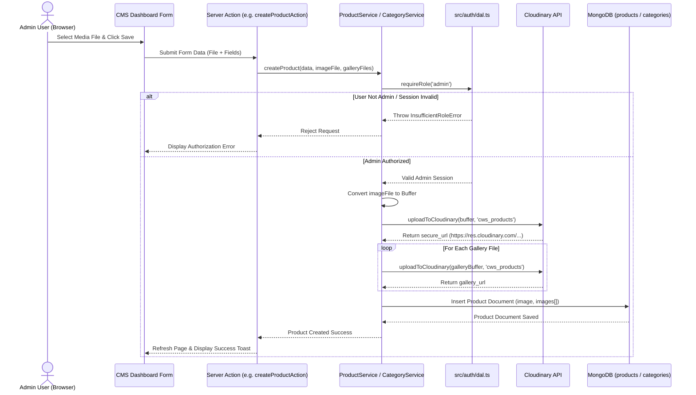

# Cloudinary & Authenticated User Assets Architecture

**Document Path**: `/docs/architecture/cloudinary-user-assets.md`  
**Related Documents**: [Architecture Index](file:///Users/User/Documents/projects/cws-proj/cws-next-app/docs/architecture/README.md) | [Authentication Overview](file:///Users/User/Documents/projects/cws-proj/cws-next-app/docs/architecture/authentication-overview.md) | [Database Structure](file:///Users/User/Documents/projects/cws-proj/cws-next-app/docs/architecture/database-structure.md)

---

## 1. Cloudinary Integration Architecture

The application uses Cloudinary as its asset storage provider for media managed by administrative users in Content Management System (CMS) features.

### Key Integration Characteristics:
- **SDK & Helper Location**: [src/lib/cloudinary.ts](file:///Users/User/Documents/projects/cws-proj/cws-next-app/src/lib/cloudinary.ts).
- **Server-Side Streaming**: Uploads execute server-side using Cloudinary Node.js SDK v2 (`cloudinary.uploader.upload_stream`). The client browser streams raw image bytes directly to Next.js Server Actions, which push the stream to Cloudinary. Direct client-side unsigned uploads are **disabled**.
- **Transport Security**: Configured with `secure: true` to ensure all asset URLs return HTTPS endpoints (`https://res.cloudinary.com/...`).
- **Environment Variables**:
  - `CLOUDINARY_CLOUD_NAME`
  - `CLOUDINARY_API_KEY`
  - `CLOUDINARY_API_SECRET`
  *(Secret values are strictly maintained in serverless environment configuration; never exposed in public prefixes or client JavaScript).*

---

## 2. Authentication & Authorization Scoping

All Cloudinary media uploads are strictly guarded by server-side authorization controls:

```text
Browser Client Upload (Form / File)
       │
       ▼
Next.js Server Action (createCategoryAction / createProductAction / updateSectionAction)
       │
       ▼
CategoryService / ProductService / SectionService
       │
       ▼
DAL Authorization Assertion: requireRole('admin') (src/auth/dal.ts)
       │
       ├─► [Denied: InsufficientRoleError] ──► Upload Aborted
       │
       ▼
[Allowed] Convert File to Buffer ──► uploadToCloudinary(buffer, folder)
       │
       ▼
Cloudinary Server Upload Stream ──► Secure URL Saved to MongoDB Collection
```

### Folder Architecture & Scoping:
Media assets are segregated into specific Cloudinary folders based on feature domain:
1. **`cws_categories`**: Category cover images. Managed by `CategoryService` ([src/auth/services/category.service.ts](file:///Users/User/Documents/projects/cws-proj/cws-next-app/src/auth/services/category.service.ts)).
2. **`cws_products`**: Product featured images and gallery arrays. Managed by `ProductService` ([src/auth/services/product.service.ts](file:///Users/User/Documents/projects/cws-proj/cws-next-app/src/auth/services/product.service.ts)).
3. **`cws_sections/{sectionId}`**: Landing page section background media (images and videos up to 50 MB). Managed by `SectionService` ([src/auth/services/section.service.ts](file:///Users/User/Documents/projects/cws-proj/cws-next-app/src/auth/services/section.service.ts)).

---

## 3. Detailed Upload Workflow & Sequence Diagram

1. **User Action**: An authenticated administrator selects an image/video file in the CMS dashboard UI and submits the form.
2. **Client Validation**: UI checks file size (max 10 MB for images, 50 MB for section videos) and mime type (`image/jpeg`, `image/png`, `image/webp`, `image/avif`).
3. **Server Action Execution**: File is sent as a `File` or `FormData` object to the corresponding Server Action.
4. **Server Authorization Check**: Service executes `await requireRole('admin')`. If unauthenticated or non-admin, the action halts immediately.
5. **Buffer Conversion**: Server converts `File.arrayBuffer()` into a Node `Buffer.from()`.
6. **Cloudinary Stream Push**: Calls `uploadToCloudinary(buffer, targetFolder)`.
7. **Cloudinary Response**: Cloudinary processes the upload, applies automatic format optimization, and returns `secure_url`.
8. **MongoDB Persistence**: The returned `secure_url` is stored in the respective MongoDB document (`categories.image`, `products.image`, `products.images[]`, `sections.media`).
9. **Audit Log Record**: An entry is written to `audit_logs` capturing the admin actor ID, resource type, and changed fields.



---

## 4. Failure Modes and Consistency Matrix

The table below documents how the system behaves during upload disruptions, network timeouts, and database errors:

| Failure Point | Current Application Behavior | MongoDB State | Cloudinary State | Risk Assessment | Recommended Recovery |
| :--- | :--- | :--- | :--- | :--- | :--- |
| **Upload Fails Before Database Update** | Exception caught in service (`uploadToCloudinary` throws); operation aborts | Unchanged (No record created/updated) | No asset uploaded | **Zero orphan risk**. Client receives upload failure error message. | Operator verifies Cloudinary API keys / quota and retries. |
| **Upload Succeeds, Database Update Fails** | Asset successfully uploaded to Cloudinary, but MongoDB write fails | Unchanged (DB insert/update throws) | Image exists in Cloudinary folder | **Low Orphan Risk**. Media exists on Cloudinary without a DB reference. | Implement background garbage collection script to purge unreferenced Cloudinary assets. |
| **Category / Product Updated with New Image**| New image uploaded to Cloudinary; document updated with new URL | Document updated with new `image` URL | Old image remains in Cloudinary folder | **Storage Accumulation**. Old image is not deleted automatically. | Add Cloudinary `destroy()` API call in update services to remove old asset public ID upon successful update. |
| **Category / Product Deleted** | Document deleted from MongoDB via `deleteProduct()` or `deleteCategory()` | Document removed from collection | Images remain stored in Cloudinary | **Storage Accumulation**. Asset URLs deleted from DB but media remains in cloud. | Update `deleteProduct()` / `deleteCategory()` to parse public ID from URL and call Cloudinary deletion API. |
| **Unauthorized File Type Submitted** | Validation error thrown in `validateMediaFile()` before Cloudinary call | Unchanged | No asset uploaded | **Zero Risk**. Non-image / oversized files blocked at server boundary. | User informed of valid formats (JPG, PNG, WebP, AVIF) and size limits. |
