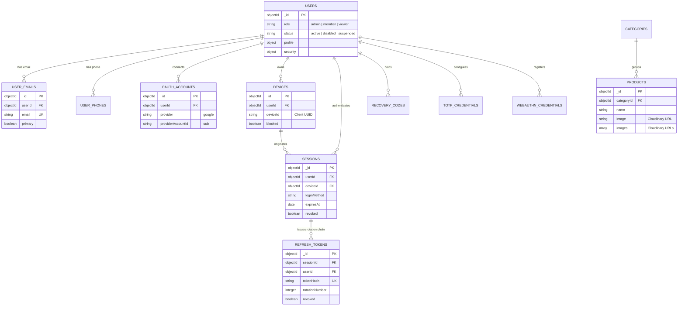

# MongoDB Database Structure & Schema Specifications

**Document Path**: `/docs/architecture/database-structure.md`  
**Related Documents**: [Architecture Index](file:///Users/User/Documents/projects/cws-proj/cws-next-app/docs/architecture/README.md) | [Authentication Overview](file:///Users/User/Documents/projects/cws-proj/cws-next-app/docs/architecture/authentication-overview.md) | [Authorization Model](file:///Users/User/Documents/projects/cws-proj/cws-next-app/docs/architecture/authorization-and-route-protection.md)

---

## 1. Collection Inventory

The application uses **21 MongoDB collections**. All collection names are strictly managed via constants in [src/database/constants.ts](file:///Users/User/Documents/projects/cws-proj/cws-next-app/src/database/constants.ts) and enforced at the database level with `$jsonSchema` strict validation.

| Collection Name | Purpose | Schema File Path | Used By Services | Related Collections |
| :--- | :--- | :--- | :--- | :--- |
| `users` | Central user identity & security metadata | [src/database/schemas/users.schema.ts](file:///Users/User/Documents/projects/cws-proj/cws-next-app/src/database/schemas/users.schema.ts) | `UserRepository`, `LoginService` | `user_emails`, `sessions`, `devices` |
| `user_emails` | User email addresses (unique constraint) | [src/database/schemas/user-emails.schema.ts](file:///Users/User/Documents/projects/cws-proj/cws-next-app/src/database/schemas/user-emails.schema.ts) | `UserRepository` | `users` |
| `user_phones` | User phone numbers | [src/database/schemas/user-phones.schema.ts](file:///Users/User/Documents/projects/cws-proj/cws-next-app/src/database/schemas/user-phones.schema.ts) | `UserRepository` | `users` |
| `oauth_accounts` | Linked OAuth provider accounts (Google, etc.)| [src/database/schemas/oauth-accounts.schema.ts](file:///Users/User/Documents/projects/cws-proj/cws-next-app/src/database/schemas/oauth-accounts.schema.ts) | `OAuthAccountRepository` | `users` |
| `devices` | Tracked user devices, IP history & blocks | [src/database/schemas/devices.schema.ts](file:///Users/User/Documents/projects/cws-proj/cws-next-app/src/database/schemas/devices.schema.ts) | `DeviceRepository`, `DeviceService` | `users`, `sessions` |
| `sessions` | Active user access sessions | [src/database/schemas/sessions.schema.ts](file:///Users/User/Documents/projects/cws-proj/cws-next-app/src/database/schemas/sessions.schema.ts) | `SessionRepository`, `SessionService` | `users`, `devices`, `refresh_tokens` |
| `refresh_tokens` | Hashed refresh tokens for token rotation | [src/database/schemas/refresh-tokens.schema.ts](file:///Users/User/Documents/projects/cws-proj/cws-next-app/src/database/schemas/refresh-tokens.schema.ts) | `RefreshTokenRepository` | `sessions`, `users` |
| `verification_tokens`| Account activation & password reset tokens | [src/database/schemas/verification-tokens.schema.ts](file:///Users/User/Documents/projects/cws-proj/cws-next-app/src/database/schemas/verification-tokens.schema.ts) | `VerificationTokenRepository` | `users` |
| `otp_codes` | Short-lived email 2FA OTP codes | [src/database/schemas/otp-codes.schema.ts](file:///Users/User/Documents/projects/cws-proj/cws-next-app/src/database/schemas/otp-codes.schema.ts) | `TwoFactorService` | `users` |
| `recovery_codes` | Single-use 8-digit MFA backup recovery codes | [src/database/schemas/recovery-codes.schema.ts](file:///Users/User/Documents/projects/cws-proj/cws-next-app/src/database/schemas/recovery-codes.schema.ts) | `MfaService` | `users` |
| `audit_logs` | Security audit trail of all auth actions | [src/database/schemas/audit-logs.schema.ts](file:///Users/User/Documents/projects/cws-proj/cws-next-app/src/database/schemas/audit-logs.schema.ts) | `AuditLogRepository` | `users`, `sessions` |
| `login_attempts` | Login failure history & rate limiting | [src/database/schemas/login-attempts.schema.ts](file:///Users/User/Documents/projects/cws-proj/cws-next-app/src/database/schemas/login-attempts.schema.ts) | `LoginAttemptRepository` | `users` |
| `totp_credentials` | Encrypted TOTP secret keys | [src/database/schemas/totp-credentials.schema.ts](file:///Users/User/Documents/projects/cws-proj/cws-next-app/src/database/schemas/totp-credentials.schema.ts) | `MfaService` | `users` |
| `webauthn_credentials`| Registered FIDO2 / WebAuthn public keys | [src/database/schemas/webauthn-credentials.schema.ts](file:///Users/User/Documents/projects/cws-proj/cws-next-app/src/database/schemas/webauthn-credentials.schema.ts)| `MfaService` | `users` |
| `mobile_auth_challenges`| Mobile login challenges & nonces | [src/database/schemas/mobile-auth-challenges.schema.ts](file:///Users/User/Documents/projects/cws-proj/cws-next-app/src/database/schemas/mobile-auth-challenges.schema.ts)| `MobileAuthService` | `users` |
| `system_settings` | System configuration & feature flags | [src/database/schemas/system-settings.schema.ts](file:///Users/User/Documents/projects/cws-proj/cws-next-app/src/database/schemas/system-settings.schema.ts) | Admin Service | None |
| `password_policies`| Enforced password complexity rules | [src/database/schemas/password-policies.schema.ts](file:///Users/User/Documents/projects/cws-proj/cws-next-app/src/database/schemas/password-policies.schema.ts)| `PasswordService` | None |
| `password_history` | Historical Argon2id hashes to prevent reuse | [src/database/schemas/password-history.schema.ts](file:///Users/User/Documents/projects/cws-proj/cws-next-app/src/database/schemas/password-history.schema.ts) | `PasswordService` | `users` |
| `categories` | CMS product categories | [src/database/schemas/categories.schema.ts](file:///Users/User/Documents/projects/cws-proj/cws-next-app/src/database/schemas/categories.schema.ts) | `CategoryService` | `products` |
| `products` | CMS product catalog items | [src/database/schemas/products.schema.ts](file:///Users/User/Documents/projects/cws-proj/cws-next-app/src/database/schemas/products.schema.ts) | `ProductService` | `categories` |
| `sections` | CMS landing page section copy & media | [src/database/schemas/sections.schema.ts](file:///Users/User/Documents/projects/cws-proj/cws-next-app/src/database/schemas/sections.schema.ts) | `SectionService` | None |

---

## 2. Database Relationship Diagram (ERD)

The entity-relationship diagram below shows how MongoDB documents reference each other via `ObjectId` links:



---

## 3. Detailed Field Schemas for Core Collections

### 1. `users` Collection
- **`_id`**: `ObjectId` (Primary Key)
- **`role`**: `String` (`'admin' | 'member' | 'viewer'`) — RBAC role.
- **`status`**: `String` (`'active' | 'inactive' | 'disabled' | 'suspended' | 'deleted'`)
- **`profile`**: `Object`
  - `displayName`: `String` (1-120 chars)
  - `firstName` / `lastName`: `String | null`
  - `avatar`: `Object | null` (`url`, `source`, `originalUrl`, `updatedAt`)
- **`password`**: `Object | null` (`hash`, `algorithm: 'argon2id' | 'bcrypt'`)
- **`security`**: `Object`
  - `failedLoginAttempts`: `Integer` ($\ge 0$)
  - `lockedUntil`: `Date | null`
  - `mfaEnabled`: `Boolean`
  - `forcePasswordChange`: `Boolean`
  - `accountSecurityVersion`: `Integer` (Incremented to invalidate all sessions across devices)

### 2. `sessions` Collection
- **`_id`**: `ObjectId` (Primary Key)
- **`userId`**: `ObjectId` (Foreign Key -> `users._id`)
- **`deviceId`**: `ObjectId | null` (Foreign Key -> `devices._id`)
- **`latestRefreshTokenId`**: `ObjectId | null` (Foreign Key -> `refresh_tokens._id`)
- **`loginMethod`**: `String` (`'password' | 'google' | 'linkedin' | 'whatsapp'`)
- **`ipAddress`**: `String` (Client IP)
- **`lastActivityAt`**: `Date` (Updated on active requests)
- **`lastFullAuthAt`**: `Date | null` (Absolute clock anchor for refresh limits)
- **`expiresAt`**: `Date` (Access session TTL)
- **`revoked`**: `Boolean`
- **`accountSecurityVersion`**: `Integer | null` (Snapshot of user security version at session creation)

### 3. `refresh_tokens` Collection
- **`_id`**: `ObjectId` (Primary Key)
- **`sessionId`**: `ObjectId` (Foreign Key -> `sessions._id`)
- **`userId`**: `ObjectId` (Foreign Key -> `users._id`)
- **`tokenHash`**: `String` (SHA-256 hash of opaque token, Unique Index)
- **`rotationNumber`**: `Integer` (Increments on each rotation)
- **`rotatedFrom`**: `ObjectId | null`
- **`replacedBy`**: `ObjectId | null`
- **`reuseDetected`**: `Boolean`
- **`revoked`**: `Boolean`
- **`expiresAt`**: `Date` (TTL Index for automatic database purging)

---

## 4. Database Index Documentation

Automated index management is defined in [src/database/indexes/index.ts](file:///Users/User/Documents/projects/cws-proj/cws-next-app/src/database/indexes/index.ts):

| Collection | Index Fields | Type / Options | Used By Query |
| :--- | :--- | :--- | :--- |
| `user_emails` | `{ email: 1 }` | Unique | User lookup by email on login |
| `oauth_accounts` | `{ provider: 1, providerAccountId: 1 }` | Unique Compound | OAuth callback user resolution |
| `devices` | `{ userId: 1, serverDeviceId: 1 }` | Compound | Device binding check on login |
| `sessions` | `{ userId: 1, revoked: 1 }` | Compound | Concurrent session cap & user sessions list |
| `sessions` | `{ expiresAt: 1 }` | TTL Index (expireAfterSeconds: 0) | Automatic MongoDB cleanup of expired sessions |
| `refresh_tokens` | `{ tokenHash: 1 }` | Unique | Refresh token lookup during rotation |
| `refresh_tokens` | `{ expiresAt: 1 }` | TTL Index (expireAfterSeconds: 0) | Automatic MongoDB cleanup of expired refresh tokens |
| `otp_codes` | `{ expiresAt: 1 }` | TTL Index (expireAfterSeconds: 0) | Automatic purging of expired email OTP codes |
| `login_attempts` | `{ ipAddress: 1, createdAt: 1 }` | Compound | Rate limit sliding window query |
| `products` | `{ categoryId: 1 }` | Single Field | Product queries grouped by category |
| `sections` | `{ sectionId: 1 }` | Unique | CMS page section copy lookup |

---

## 5. Data Lifecycle & Purging Policies

1. **Automatic Purging (TTL Indexes)**:
   - `sessions`, `refresh_tokens`, `verification_tokens`, and `otp_codes` use MongoDB TTL indexes. Records automatically expire and are purged by MongoDB background threads.
2. **Soft Account Deletion**:
   - Accounts are soft-deleted by setting `status = 'deleted'` and recording `deletedAt = now`. Related sessions and refresh tokens are immediately revoked.
3. **Orphan Prevention**:
   - Deleting a category or product clears the record from MongoDB. Cloudinary images are managed via service cleanup hooks.

---

## 6. Sanitized JSON Document Examples

### `users` Document Example:
```json
{
  "_id": { "$oid": "6697fa21b5e3c12a89f01234" },
  "profile": {
    "displayName": "System Admin",
    "firstName": "System",
    "lastName": "Admin",
    "avatar": {
      "url": "https://res.cloudinary.com/demo/image/upload/v1/cws_catalog/avatar.jpg",
      "source": "upload",
      "updatedAt": { "$date": "2026-07-20T10:00:00Z" }
    }
  },
  "password": {
    "hash": "$argon2id$v=19$m=65536,t=3,p=4$...",
    "algorithm": "argon2id"
  },
  "role": "admin",
  "status": "active",
  "loginMethods": ["password", "google"],
  "security": {
    "failedLoginAttempts": 0,
    "lockedUntil": null,
    "mfaEnabled": true,
    "forcePasswordChange": false,
    "accountSecurityVersion": 1
  },
  "createdAt": { "$date": "2026-07-01T00:00:00Z" },
  "updatedAt": { "$date": "2026-07-20T10:00:00Z" }
}
```

### `sessions` Document Example:
```json
{
  "_id": { "$oid": "66981122b5e3c12a89f05678" },
  "userId": { "$oid": "6697fa21b5e3c12a89f01234" },
  "deviceId": { "$oid": "66980000b5e3c12a89f09999" },
  "latestRefreshTokenId": { "$oid": "66981122b5e3c12a89f08888" },
  "loginMethod": "password",
  "platform": "web",
  "browser": "Chrome",
  "operatingSystem": "macOS",
  "ipAddress": "192.0.2.1",
  "refreshCount": 2,
  "lastActivityAt": { "$date": "2026-07-22T18:45:00Z" },
  "lastFullAuthAt": { "$date": "2026-07-22T18:00:00Z" },
  "expiresAt": { "$date": "2026-07-22T19:00:00Z" },
  "revoked": false,
  "accountSecurityVersion": 1,
  "createdAt": { "$date": "2026-07-22T18:00:00Z" }
}
```
