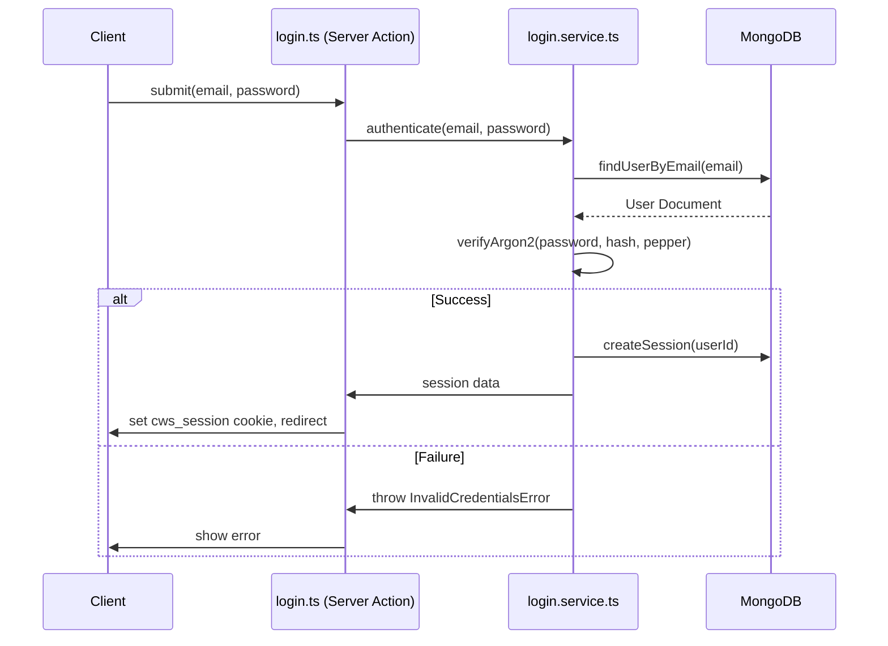
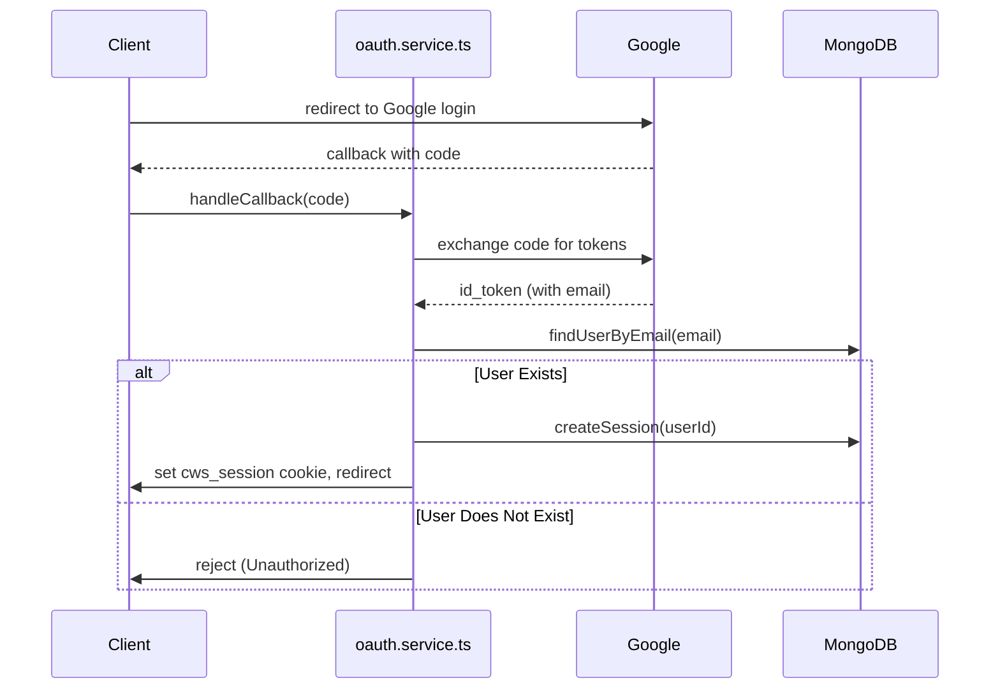
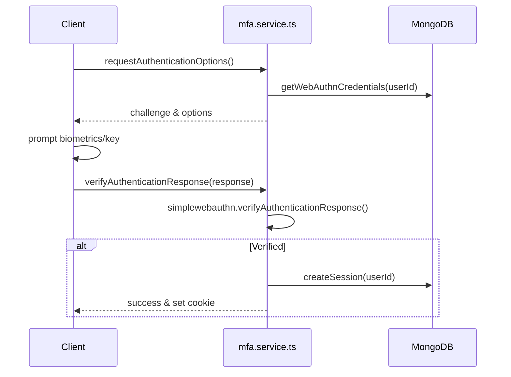
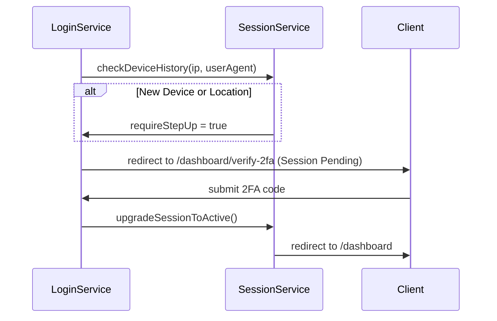

# Authentication Workflows

This document outlines the step-by-step logic and sequence of operations for the primary authentication workflows in the application.

## 1. Password Login

The password login flow ensures the user exists, verifies the Argon2 hash against the stored hash + server pepper, and establishes a secure session.

## 2. Google OAuth Login

Google OAuth uses the Authorization Code flow. We do not support public registration, so if a user signs in with Google but their email is not present in our database, they are rejected.

## 3. WebAuthn (Passkeys)

We use `@simplewebauthn/server` for passkeys. 

## 4. Step-Up MFA

Step-Up MFA is triggered when a user logs in from a **new device** or a **new country/location**. When this happens, their session is created but marked as pending, and they must verify a code (via Email/TOTP/WebAuthn) before the session becomes fully active.

