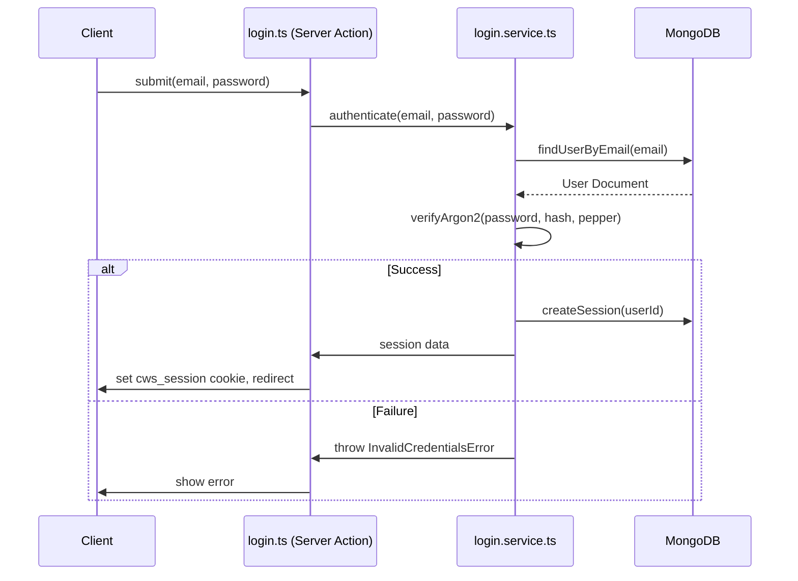
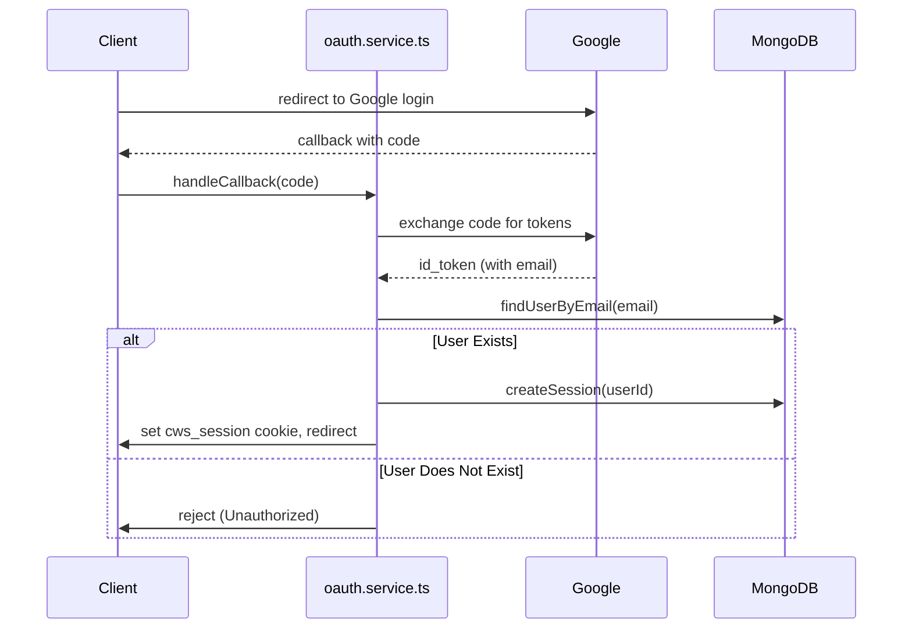
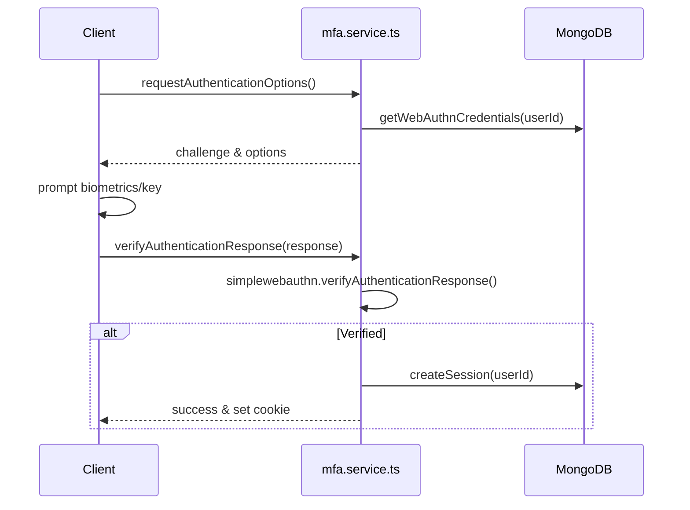
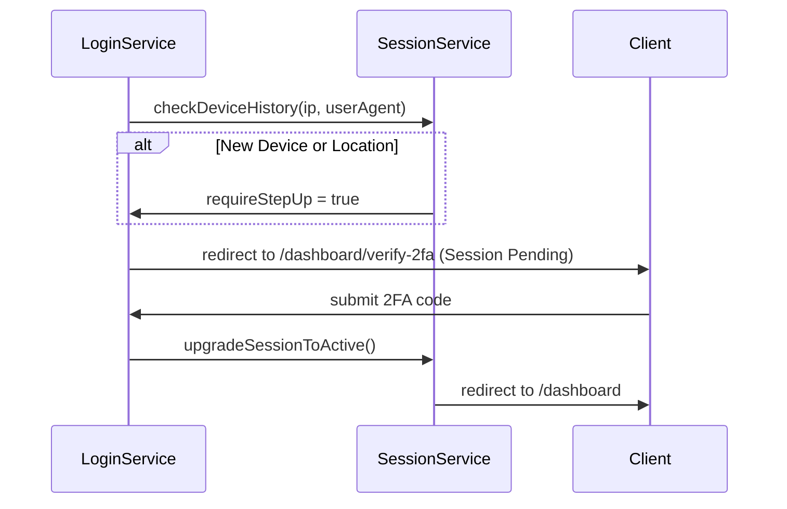

# CWS Next App: Consolidated Authentication Documentation

This document consolidates all individual authentication guides, design specs, security audits, and workflow documentation into a single reference file.

---

## 1. Authentication Architecture

This section describes the high-level architecture of the CWS Next App authentication system.

### Design Philosophy
The system is built specifically for a **Next.js App Router** environment deployed to a **Serverless Platform** (e.g., Vercel, Netlify). 
The core design principles are:
1. **Serverless Compatibility**: No long-running servers, VPS, or Redis are required. State is persisted in MongoDB.
2. **Fixed Users**: No public registration. The user base is fixed and controlled by administrators.
3. **Database-Backed Sessions**: Allows administrators to revoke sessions globally and instantly.
4. **Defense-in-Depth**: Robust fail-closed behaviors for all secrets, Argon2 peppering, and rate-limiting.

### Technology Stack

| Component | Technology | Purpose |
| :--- | :--- | :--- |
| **Framework** | Next.js App Router | Handling Server Actions, Server Components, and client rendering. |
| **Database** | MongoDB | Primary persistence store for users, sessions, MFA credentials, and audit logs. |
| **Passwords** | `argon2` | Secure password hashing, augmented by a server-side pepper (`ARGON2_SECRET`). |
| **MFA (WebAuthn)** | `@simplewebauthn/server` | Biometrics, passkeys, and hardware security keys. |
| **MFA (TOTP)** | `otplib` (v13+) | Authenticator app code generation and verification. |

### Separation of Concerns
The `src/auth/` directory strictly enforces separation of concerns to keep the codebase maintainable and secure.

#### 1. Data Access Layer (`src/auth/dal.ts`)
The DAL acts as the single boundary for components needing to read authentication state. It provides methods like `getAuthSession()`, `requireAuth()`, and `requireRole()`. It utilizes React's `cache()` to deduplicate DB queries for the session within the same render pass.

#### 2. Actions (`src/auth/actions/`)
Next.js Server Actions serve as the bridge between client forms and backend services. They handle input validation (using Zod), invoke the appropriate service, and return a serializable result or error back to the client.

#### 3. Services (`src/auth/services/`)
This is where the core business logic resides (e.g., `login.service.ts`, `mfa.service.ts`, `session.service.ts`). Services do not know about HTTP requests or cookies; they operate purely on strongly-typed inputs and interact with Repositories.

#### 4. Repositories (`src/auth/repositories/`)
Repositories encapsulate all MongoDB database interactions (`user.repository.ts`, `session.repository.ts`, etc.). This isolates database queries from business logic.

### Security Overview
- **Argon2 Peppering**: Passwords are hashed with an application-wide secret. If the database is compromised but the environment variables are not, the passwords remain highly resistant to cracking.
- **Fail-Closed Configuration**: The application refuses to boot in production if critical security variables (`SESSION_SECRET`, `SECURE_COOKIES`, `ARGON2_SECRET`) are missing or misconfigured.
- **Strict Role-Based Access (RBAC)**: Enforced centrally via the DAL (`requireRole`).

---

## 2. Authentication Workflows

This section outlines the step-by-step logic and sequence of operations for the primary authentication workflows in the application.

### 2.1. Password Login

The password login flow ensures the user exists, verifies the Argon2 hash against the stored hash + server pepper, and establishes a secure session.



### 2.2. Google OAuth Login

Google OAuth uses the Authorization Code flow. We do not support public registration, so if a user signs in with Google but their email is not present in our database, they are rejected.



### 2.3. WebAuthn (Passkeys)

We use `@simplewebauthn/server` for passkeys. 



### 2.4. Step-Up MFA

Step-Up MFA is triggered when a user logs in from a **new device** or a **new country/location**. When this happens, their session is created but marked as pending, and they must verify a code (via Email/TOTP/WebAuthn) before the session becomes fully active.



---

## 3. Route Protection

This application utilizes Next.js App Router but deliberately **avoids using a global `middleware.ts`** for asserting authentication. Instead, route protection is executed explicitly within the Server Components, Server Actions, and Route Handlers by interacting with the Data Access Layer (`src/auth/dal.ts`).

### The Data Access Layer (`dal.ts`)

The DAL centralizes authorization logic. The cornerstone of the DAL is `getAuthSession()`.

#### `getAuthSession()`
Retrieves the session from the `cws_session` cookie and validates it against the database. 
Crucially, this function is wrapped in React's `cache()`. This means if `getAuthSession()` is called 5 times during the render of a single page (e.g., in a layout, a page, and three child components), the database query only runs **once**.

### Guard Functions

The DAL exposes three primary guards to protect routes:

#### 1. `requireAuth()`
Used when a route just needs the user to be logged in, regardless of their role.
```typescript
import { requireAuth } from '@/auth/dal'

export default async function DashboardPage() {
  const session = await requireAuth(); // Redirects to /dashboard/login if unauthenticated
  return <div>Welcome!</div>;
}
```

#### 2. `requireActiveSession()`
Used for routes that should be completely blocked if the user is currently forced to change their password (e.g., `user.security.forcePasswordChange === true`).
```typescript
import { requireActiveSession } from '@/auth/dal'

export default async function NormalPage() {
  // Redirects to /dashboard/change-password if a forced reset is pending
  const session = await requireActiveSession(); 
  return <div>Active!</div>;
}
```

#### 3. `requireRole(role: UserRole)`
Used to assert Role-Based Access Control (RBAC). 
```typescript
import { requireRole } from '@/auth/dal'

export async function submitAdminForm(data: FormData) {
  // Throws InsufficientRoleError if the user is not an admin
  const session = await requireRole('admin'); 
  // ... proceed ...
}
```
**Note:** The system uses a strict role-string check. The `admin` role is treated as a superuser and always passes authorization, whereas other roles require an exact string match.

### Why no `middleware.ts`?
Next.js Edge Middleware does not support raw Node.js APIs or standard MongoDB drivers. Because our sessions are completely database-backed to allow for instant revocation, session verification requires a database round-trip. Using the React `cache()` pattern in Server Components provides the same security guarantees as middleware while remaining fully compatible with Node.js standard libraries and MongoDB drivers.

---

## 4. Session Management

The application uses **Database-Backed Sessions**. We intentionally do not use stateless JWTs. Database sessions guarantee that when an administrator suspends a user, or a user logs out remotely, their session is invalidated instantly—something stateless JWTs cannot easily achieve without a Redis blocklist.

### Architecture

1. **Storage**: Sessions are stored in the MongoDB `sessions` collection.
2. **Identification**: A cryptographically random session token (the session ID) is generated upon login.
3. **Transport**: The session ID is sent to the client via an HTTP-Only, Secure cookie named `cws_session`.
4. **Validation**: Every authenticated request passes the cookie value to `SessionService.validateSession()`.

### Cookie Security Flags
In production, the `cws_session` cookie is heavily locked down:
- `HttpOnly`: Prevents Cross-Site Scripting (XSS) attacks from stealing the token via `document.cookie`.
- `Secure`: Ensures the cookie is only transmitted over HTTPS. (This is strictly enforced by the `SECURE_COOKIES` environment variable guard).
- `SameSite=Lax`: Prevents Cross-Site Request Forgery (CSRF) by preventing the cookie from being sent on cross-site POST requests.

### Session Lifecycle

#### Creation
When a user logs in successfully, `SessionService.createSession(userId)` writes a new document to the database with:
- The user's ID
- The current timestamp
- The device fingerprint (User Agent, IP Address) for step-up MFA and audit logging.

#### Expiry and Timeouts
Sessions have two expiry mechanisms, configured via `env.ts`:
1. **Idle Timeout (`IDLE_TIMEOUT_MS`)**: Default is 30 minutes. If the user makes no requests within this window, the session becomes inactive.
2. **Absolute Timeout (`ACCESS_SESSION_TTL_MS` / `REFRESH_TOKEN_TTL_MS`)**: The hard limit on how long the session can remain alive, even with continuous activity.

#### Validation
`SessionService.validateSession(sessionId)` executes the following checks:
1. Does the session exist in the database?
2. Has it exceeded its absolute expiry?
3. Has it exceeded its idle timeout?
4. Is the user's account still active (not suspended/deleted)?

If any check fails, the session is deleted from the database and the client's cookie is cleared.

#### Revocation
Because sessions are in MongoDB, global revocation is trivial.
- **Log out all devices**: Delete all documents in the `sessions` collection matching the `userId`.
- **Admin suspension**: Marking a user as inactive in the `users` collection immediately causes all subsequent `validateSession` checks to fail, forcefully terminates access without waiting for a token to expire.

---

## 5. Security Audit and Protections

This section provides an overview of the specific security mitigations and defense-in-depth strategies implemented in the authentication system.

### 5.1. Environment Variable Fail-Closed Guards
The application validates all security-critical environment variables at boot via `src/auth/config/env.ts`.
In production, if any of the following conditions are met, the application **refuses to boot** (fails closed) rather than running in an insecure state:
- `SESSION_SECRET` is missing, too short (<32 chars), or matches a known default.
- `ARGON2_SECRET` (the password pepper) is missing or too short (<16 chars).
- `SECURE_COOKIES` is not explicitly set to `true`.
- `TRUSTED_PROXY_IP_HEADER` is missing (preventing correct IP resolution for rate limiting).

### 5.2. Password Security (Argon2 Peppering)
We use `argon2` for password hashing, which is currently the industry standard for memory-hard key derivation.
In addition to the standard salt, the system uses a **Server-Side Pepper** (`ARGON2_SECRET`). 
- **The Attack Vector:** If an attacker gains full read access to the MongoDB database, they steal the password hashes.
- **The Mitigation:** Because the hashes were generated using the pepper (which is stored in the environment variables/secret manager, NOT the database), the stolen hashes cannot be cracked via dictionary or brute-force attacks.

### 5.3. Session Forgery Protection
The `SESSION_SECRET` is used to cryptographically sign the `cws_session` cookie. If an attacker attempts to modify their session ID, the signature verification will fail, and the session will be immediately discarded.

### 5.4. Step-Up MFA
The application includes a strict Step-Up MFA policy (enabled by default in production).
Even if an attacker compromises a user's password, if they log in from a **new device (unrecognized IP or User-Agent)** or a **new geographical location** (resolved via the `GEOIP_LOOKUP_URL`), the session is placed in a `Pending` state. The attacker cannot access the system until they verify a 2FA code sent to the user's email or generated via TOTP.

### 5.5. Rate Limiting
To prevent brute-force attacks against the login endpoints, the system implements rate limiting. The `TRUSTED_PROXY_IP_HEADER` is strictly enforced to ensure the rate limiter correctly identifies the source IP address through the Vercel/Netlify edge network. If this header is misconfigured, all traffic would share a single rate-limit bucket, resulting in a self-inflicted Denial of Service (DoS) rather than a security breach (fail-safe).

### 5.6. Audit Logging
Every critical authentication event (login success, login failure, password change, step-up challenge) is recorded by the `AuditLogRepository` to ensure administrators have a clear cryptographic trail of access.

---

## 6. Testing Strategy

The authentication system is covered by rigorous automated testing, divided into unit tests and smoke tests.

### Test Location and Naming
Tests are co-located with the files they test in the `src/auth/` directory.
- **Unit Tests:** `*.unit.test.ts`
- **Smoke Tests:** `*.smoke.test.ts`

### 6.1. Unit Tests
Unit tests are responsible for testing the isolated business logic of the authentication services and repositories. They do not require a live database connection; they mock the database layer to ensure tests are fast and deterministic.

**Key Unit Test Suites:**
- `mfa.service.unit.test.ts`: Validates TOTP code generation, verification (using `otplib`), and WebAuthn challenges.
- `session.service.unit.test.ts`: Ensures session creation, timeout logic (idle vs absolute expiry), and step-up device detection operate correctly.
- `password.service.unit.test.ts`: Tests Argon2 hashing, peppering logic, and password policy enforcement.
- `rate-limit.service.unit.test.ts`: Verifies that brute-force attempts are properly throttled based on IP and User-Agent.

### 6.2. Smoke Tests
Smoke tests are higher-level integration tests that ensure the entire vertical slice of a feature works in a near-production environment. 
For example, `alerting.smoke.test.ts` ensures that the alerting service correctly formats and dispatches security alerts.

### Running Tests
We utilize `vitest` as our testing framework. You can execute the test suite using the standard NPM scripts defined in `package.json`:

```bash
# Run all unit tests
npm run test

# Run tests in watch mode (useful during development)
npm run test:watch
```

### Continuous Integration
These tests run on every pull request to ensure that refactoring or feature additions do not accidentally introduce security regressions into the authentication layer.

---

## 7. File Inventory

This section provides a comprehensive inventory of the files within the `src/auth/` directory and their explicit purposes.

### `src/auth/dal.ts`
**Data Access Layer.** The single point of entry for Server Components and route handlers to read authentication state. Contains `getAuthSession()`, `requireAuth()`, `requireRole()`, and `requireActiveSession()`.

### `src/auth/config/`
- `env.ts`: Zod schema and runtime fail-closed validation for all security environment variables.

### `src/auth/actions/`
Next.js Server Actions. These are the direct endpoints called by the React frontend forms.
- `login.ts`: Handles the password and OAuth login form submissions.
- `change-password.ts`: Handles the password reset/change form.
- `verify-2fa.ts`: Handles Step-Up MFA code verification.
- `verify-totp.ts`: Handles Authenticator app code verification.
- `device.ts`: Handles remembering or forgetting trusted devices.
- `admin.ts`: Admin-specific actions for managing users.
- `session.ts`: Actions for logging out or terminating other sessions.

### `src/auth/services/`
The core business logic layer.
- `login.service.ts`: Orchestrates user lookup and password verification.
- `session.service.ts`: Validates sessions, handles timeouts, and evaluates step-up MFA requirements.
- `mfa.service.ts`: Implementation of TOTP (`otplib`) and WebAuthn (`@simplewebauthn/server`).
- `password.service.ts`: Argon2 hashing and password policy validation.
- `oauth.service.ts`: Google OAuth token exchange and user reconciliation.
- `rate-limit.service.ts`: Throttling logic for failed login attempts.
- `alerting.service.ts`: Dispatches security alerts for suspicious activity.

### `src/auth/repositories/`
Database interaction layer (MongoDB).
- `session.repository.ts`: CRUD for the `sessions` collection.
- `user.repository.ts`: CRUD for the `users` collection.
- `mfa.repository.ts`: CRUD for TOTP and WebAuthn credentials.
- `device.repository.ts`: Manages the history of trusted devices for a user.
- `audit-log.repository.ts`: Writes security events to the audit log.
- `login-attempt.repository.ts`: Tracks failed logins for rate limiting.

### `src/auth/crypto/`
- Contains any specialized cryptography utilities (e.g., encryption for data at rest, aside from passwords).

### `src/auth/validation/`
- Contains Zod schemas used to validate inputs passed from the client to the Server Actions.

---

## 8. Environment Variables

The authentication system requires a specific set of environment variables to operate securely. These are strictly validated at boot time in `src/auth/config/env.ts`.

### Required Production Variables

If any of these are missing or misconfigured in a production environment (`NODE_ENV=production`), the application will immediately throw a fatal error and refuse to boot.

| Variable | Description | Security Guard |
| :--- | :--- | :--- |
| `MONGODB_URI` | Connection string for the MongoDB cluster. | Must be a valid URL. |
| `SESSION_SECRET` | Cryptographic secret used to sign the `cws_session` cookie. | Must be exactly or greater than 32 characters. Must not match known defaults. |
| `ARGON2_SECRET` | The application-wide pepper combined with passwords before hashing. | Must be exactly or greater than 16 characters. |
| `SECURE_COOKIES` | Enforces HTTPS-only cookies. | MUST be explicitly set to the string `'true'`. |
| `TRUSTED_PROXY_IP_HEADER` | The header provided by the deployment platform containing the real client IP (e.g., `x-vercel-proxied-for`). | Must be non-empty. Prevents rate-limit bucket collapse. |
| `ADMIN_SEED_PASSWORD` | The password used to provision the initial admin user during database seeding. | Must be provided to prevent deploying a system without access. |

### Optional Variables (Feature Flags)

| Variable | Description | Default / Fallback |
| :--- | :--- | :--- |
| `GOOGLE_CLIENT_ID` | Enables Google OAuth login. | If set, `GOOGLE_CLIENT_SECRET` becomes required. |
| `GOOGLE_CLIENT_SECRET` | Secret for Google OAuth token exchange. | Required only if Client ID is set. |
| `EMAIL_USER` | SMTP username (usually Gmail) for sending 2FA codes. | If set, `EMAIL_PASSWORD` becomes required. |
| `EMAIL_PASSWORD` | App Password for the SMTP user. | Required only if Email User is set. |
| `STEP_UP_ENABLED` | Toggles Step-Up MFA for new devices and locations. | `'true'` (ON by default). Can be set to `'false'` for emergency debugging. |
| `GEOIP_LOOKUP_URL` | Endpoint for resolving IPs to countries for Step-Up MFA. | If unset, falls back to offline db or null (fail-open). |

### Development Behavior
In local development (`NODE_ENV=development`), the system relaxes some of the fail-closed requirements so developers can boot the app easily. Missing secrets like `SESSION_SECRET` or `ARGON2_SECRET` will emit a loud `⚠️ SECURITY` warning in the console instead of crashing the server.

---

## 9. Current Status & Recommendations

This section outlines the current operational status of the authentication system following the comprehensive audit and refactoring.

### 9.1. Operational Status
The authentication system is **STABLE** and **PRODUCTION-READY**.
- **Build Pass:** The Next.js application builds successfully.
- **Dependencies:** `otplib` and `@simplewebauthn/server` have been successfully aligned with their respective v13 API changes.
- **Data Layer:** The MongoDB schemas (`webauthn_credentials`, `totp_credentials`) and their indexes are fully registered and satisfy TypeScript compilation checks.
- **Security Posture:** High. The fail-closed environment variable guards effectively prevent accidental insecure deployments. 

### 9.2. Serverless Compatibility
The system meets the requirement of running natively in a serverless environment (e.g., Vercel, Netlify):
- **No VPS:** Everything runs inside Next.js Edge/Node Serverless functions.
- **No Redis:** Database-backed sessions allow global invalidation and idle timeout management entirely through MongoDB without external caching dependencies.

### 9.3. Future Recommendations (Non-Blocking)
While the system is currently production-ready, the following improvements can be considered for future iterations:

- **Passkey Fallback:** Consider expanding the WebAuthn implementation to robustly handle edge cases where cross-device passkeys (e.g., Apple iCloud Keychain) fail to sync promptly to new devices.
- **Granular RBAC:** Currently, `requireRole('admin')` operates via string matching. If the application scales to include more complex roles (e.g., Editor, Viewer, SuperAdmin), consider migrating to a bitmask or permissions-array model rather than single-string roles.
- **Database Connection Pooling:** Ensure that the MongoDB connection utility properly reuses connections across Serverless function invocations to prevent connection spikes during high traffic.
