# Authentication Workflows

> Audit Date: 2026-07-27 | Commit: `32af9be` | Branch: `main`

---

## 1. Email/Password Login

### 1.1 Successful Login

**Entry Point**: `POST /dashboard/login` (Server Action `loginAction`) or `POST /api/auth/login` (Route Handler)

**Preconditions**:
- User exists with `status: 'active'`
- User has a configured password
- Account is not locked
- Rate limits not exceeded

**Steps**:
1. `loginAction` (wrapped with `withCsrfGuard`) receives `email`, `password`, `rememberMe`
2. `assertSameOrigin()` verifies same-origin request
3. `LoginService.loginWithPassword()` called with `{email, password, rememberMe}`, IP, User-Agent
4. Zod validation via `loginSchema.safeParse()`
5. `RateLimitService.checkRateLimit(ip, email)` — checks active lockout, IP limit (20/15min), identifier limit (10/15min)
6. `UserRepository.findByEmail()` — lookup user
7. If user NOT found: `verifyPassword(DUMMY_HASH, password)` + random delay (timing mitigation), record failure, throw `InvalidCredentialsError`
8. Account lifecycle check: `suspended` → `AccountSuspendedError`, `deleted` → `AccountDeletedError`, `inactive/disabled` → `AccountDisabledError`
9. Lockout check: `user.security.lockedUntil > now` → `AccountLockedError`
10. Password existence check: `user.password.hash` present
11. `verifyPassword(user.password.hash, password)` — Argon2id verification
12. If mismatch: `UserRepository.recordFailedLoginAndMaybeLock()` (atomic conditional write — H-5), throw `InvalidCredentialsError` or `AccountLockedError` if threshold reached
13. If match: `resetFailedAttempts()`, `recordLastLogin()`
14. Risk evaluation: `evaluateLoginRisk()` → signals → score → policy
15. If policy = `block`: throw `AccountLockedError`
16. If policy = `require_2fa` / `require_strong_2fa`: create `pending_authentications` doc, return `{status: 'mfa_required', pendingAuthToken}`
17. If password expired: `forcePasswordChange()`, return `{status: 'force_change'}`
18. `SessionService.createSession()`: enforce concurrent limit (5), register device, create session doc + refresh token, sign session ID, return cookies
19. `LoginService.issueSession()`: record login attempt, write audit log, set server device token
20. `setAuthCookies()`: set `cws_session` (Lax) + `cws_refresh` (Strict)
21. Action returns `{redirect: '/dashboard'}`

**Success State**: Browser has valid `cws_session` + `cws_refresh` cookies; redirect to `/dashboard`

**Failure State**: Error message displayed; failed attempt logged in `login_attempts` + `audit_logs`; rate limit/lockout enforced

**Tokens Involved**: `cws_session` (set), `cws_refresh` (set), `cws_device_token` (set)

**Database Changes**:
- `login_attempts`: new record
- `audit_logs`: `auth.login.success` or `auth.login.failure`
- `users`: `failedLoginAttempts` reset or incremented, `lockedUntil` set if threshold reached, `lastLoginAt` updated
- `sessions`: new session document
- `refresh_tokens`: new refresh token document
- `devices`: upserted if new device
- `pending_authentications`: created if MFA required

**Security Controls**: CSRF guard, rate limiting, account lockout (atomic), timing side-channel mitigation, risk evaluation, audit logging, device binding

**Missing/Questionable Controls**:
- No explicit brute-force delay beyond random 50ms for unknown emails
- Lockout threshold (5) is hardcoded, not per-role
- `step_up` return status is dead code (`login.ts:84-86`)

**Source Files**: `src/auth/actions/login.ts`, `src/auth/services/login.service.ts:48-210`, `src/auth/services/session.service.ts:42-177`, `src/auth/lib/cookies.ts:89-107`, `src/app/api/auth/login/route.ts`

### 1.2 Invalid Login (Wrong Password)

**Steps**: Same as 1.1 through step 12:
- `verifyPassword()` returns `false`
- `recordFailedLoginAndMaybeLock()` — increments `failedLoginAttempts`
- If count < 5: throw `InvalidCredentialsError` ('Password verification failed')
- If count = 5: atomic lock applied, throw `AccountLockedError` with lock expiry time

**Failure State**: `InvalidCredentialsError` displayed; attempt logged

**Source Files**: `src/auth/services/login.service.ts:117-141`

### 1.3 Disabled/Suspended/Deleted User

**Steps**: Same as 1.1 through step 8:
- `user.status === 'suspended'` → `AccountSuspendedError` (public: "This account has been suspended")
- `user.status === 'deleted'` → `AccountDeletedError` (public: "This account has been deactivated")
- `user.status === 'inactive' || 'disabled'` → `AccountDisabledError` (public: "This account has been disabled")

**Note**: Same generic error for all three prevents status enumeration.

**Source Files**: `src/auth/services/login.service.ts:88-99`, `src/auth/errors/auth-errors.ts:37-64`

### 1.4 Unverified User

**Current Behavior**: There is no `email_verified` flag on the `users` collection or `user_emails` collection that gates login. The `user_emails.verified` field exists but is not checked during password login. Users with `status: 'active'` can log in regardless of email verification.

**Risk**: Unverified email addresses can be used for account access. However, since this is an internal admin app with no public registration, email verification is likely handled at provisioning time.

**Source Files**: `src/auth/services/login.service.ts:71` (no email verification check)

### 1.5 Password Change

**Entry Point**: `changePasswordAction` (Server Action, wrapped with `withCsrfGuard`)

**Preconditions**: Either an active session OR a valid `cws_pw_pending` cookie

**Steps**:
1. Resolve identity: prefer `cws_pw_pending` (HMAC-signed user ID) over `cws_session` (via DAL)
2. `PasswordService.parseChange()` — Zod validation
3. `PasswordService.evaluateNewPassword()`:
   - Load active password policy
   - Validate against policy (length, character classes)
   - Evaluate strength (zxcvbn)
   - If weak and no `acceptWeakPassword`: throw `WeakPasswordConfirmationRequiredError`
   - Check password history (last N hashes)
4. `verifyPassword(user.password.hash, currentPassword)` — confirm current password
5. `hashPassword(newPassword)` — Argon2id with pepper
6. Atomic update: set `password.hash`, `passwordChangedAt`, clear `forcePasswordChange`, bump `accountSecurityVersion`
7. `historyRepo.record()` — save hash to password history
8. `revokeAllUserSessionsExcept()` — revoke all OTHER sessions
9. `invalidateAll(userId, 'password_reset')` — clear pending reset tokens
10. Audit log `auth.password.change.success`
11. If from pending cookie: clear `cws_pw_pending`

**Success State**: New password set; all other sessions revoked; redirect to `/dashboard`

**Database Changes**: `users` (password hash, security version), `password_history` (new entry), `sessions` (all others revoked), `refresh_tokens` (all others revoked), `verification_tokens` (reset tokens cleared)

**Security Controls**: Current password verification, policy enforcement, reuse prevention, session revocation on change, audit logging

**Source Files**: `src/auth/actions/change-password.ts`, `src/auth/services/password.service.ts:91-160`

### 1.6 Password Reset

**Entry Point**: `requestResetAction` + `resetPasswordAction` (both wrapped with `withCsrfGuard`)

**Request Steps**:
1. Zod validate email
2. Rate limit: per-email (5/15min), per-IP (20/15min), record attempt
3. `PasswordService.requestReset()`:
   - Per-email throttle (5/15min) via `login_attempts`
   - Lookup user by email (silently return if not found — enumeration resistance)
   - Create verification token (30 min TTL, single-use)
   - Send email with reset link: `${APP_URL}/dashboard/reset-password?token=${raw}`

**Reset Steps**:
1. Validate token + passwords match
2. Rate limit: per-token-prefix (10/15min)
3. `PasswordService.resetPassword()`:
   - Load token ownership (read without consuming)
   - `evaluateNewPassword()` — policy + strength + history
   - `tokenRepo.redeem()` — atomic single-use consumption
   - `hashPassword()` + update user document
   - `historyRepo.record()` + `revokeAllUserSessionsExcept(null)` + `invalidateAll()`
   - Send confirmation email (best-effort)
   - Audit log + alerting

**Tokens Involved**: `verification_tokens` (created, redeemed)

**Database Changes**: `verification_tokens` (created, consumed), `users` (hash updated, lockout cleared), `password_history`, `sessions` (all revoked), `refresh_tokens` (all revoked), `login_attempts` (rate limit counters)

**Security Controls**: Enumeration resistance (generic success), single-use tokens, 30-min TTL, rate limiting per email + per IP + per token, policy enforcement, all-sessions-revoked on reset

**Source Files**: `src/auth/actions/password-reset.ts`, `src/auth/services/password.service.ts:162-272`

### 1.7 Logout

**Entry Point**: `POST /api/auth/logout`

**Steps**:
1. `assertSameOriginStrict()` — CSRF guard
2. Read `cws_session` cookie
3. `verifySessionSignature()` — HMAC verify
4. `SessionService.revokeRefreshFamily(sessionId, 'logout')` — revoke all refresh tokens for session
5. `LogoutService.logout(sessionId)` — revoke session doc, audit log `auth.logout.success`
6. Clear `cws_session` (Lax) and `cws_refresh` (Strict) cookies

**Success State**: Session and refresh tokens revoked; cookies cleared; 204 response

**Database Changes**: `sessions.revoked = true`, `refresh_tokens.revoked = true`

**Security Controls**: CSRF guard, refresh family revocation (prevents stolen refresh token reuse), audit logging

**Source Files**: `src/app/api/auth/logout/route.ts`, `src/auth/services/logout.service.ts`, `src/auth/services/session.service.ts:475-480`

### 1.8 Logout from All Devices

**Entry Point**: `revokeAllOtherSessionsAction` (Server Action, wrapped with `withCsrfGuard`)

**Steps**:
1. `requireActiveSession()` — verify caller is authenticated
2. `SessionRepository.revokeAllUserSessionsExcept(userId, currentSessionId, 'user')` — revoke all OTHER sessions
3. Audit log `auth.session.revoked_all`
4. Revalidate paths

**Database Changes**: Multiple `sessions` documents revoked, associated `refresh_tokens` revoked

**Source Files**: `src/auth/actions/session.ts:117-162`

### 1.9 Session Expiration

**Accessed in**: `SessionService.validateSession()` (called by DAL on every request)

**Idle expiry**: `session.lastActivityAt + IDLE_TIMEOUT_MS <= now` → revoke session, return null
**Absolute expiry**: `session.expiresAt <= now` → revoke session, return null

**Refresh-time expiry** (FIX-C2): `rotateRefreshToken()` also checks idle + absolute against `lastFullAuthAt` and refuses to rotate if exceeded

**Last activity update**: Coalesced to max once per 60 seconds via `after()` background task

**Source Files**: `src/auth/services/session.service.ts:183-241,263-344,485-496`

---

## 2. Google Login

### 2.1 First Login / Returning Login

**Entry Point**: `GET /api/auth/google`

**Steps**:
1. `OAuthService.buildAuthorizationUrl()`:
   - Generate random `state` (32 bytes), `codeVerifier` (48 bytes), `nonce` (24 bytes)
   - Compute `codeChallenge` = SHA-256(codeVerifier), base64url
   - Build Google authorization URL with `prompt: 'select_account'`
2. Store `{state, codeVerifier, nonce}` in `cws_oauth_state` cookie (httpOnly, SameSite=Lax, 10min)
3. Redirect to Google

### 2.2 OAuth Callback

**Entry Point**: `GET /api/auth/google/callback`

**Steps**:
1. Extract `code`, `state` from URL params
2. Read `cws_oauth_state` cookie, parse JSON
3. Per-IP rate limit (20/15min for token exchange)
4. `OAuthService.handleCallback()`:
   - **CSRF**: `state !== expectedState` → reject
   - **Code exchange**: POST to `https://oauth2.googleapis.com/token` with code + code_verifier + client credentials
   - **id_token verification**:
     - Parse JWT header, verify `alg: RS256`
     - Fetch Google JWKS (cached per instance, 1hr TTL)
     - If `kid` not in cache → fresh JWKS fetch
     - RSA-SHA256 signature verify
     - Verify `iss`, `aud`, `exp`, `nonce`
   - **User lookup**: `oauthAccounts.findByProvider('google', profile.sub)`
   - **FIX-C3**: If no pre-provisioned link → reject ("Google sign-in is not enabled for this account")
   - **Account lifecycle**: `user.status !== 'active'` → reject
   - **Risk evaluation**: `evaluateLoginRisk()` with `primaryAuthenticationMethod: 'google'`
   - **MFA policy**: If `require_2fa` / `require_strong_2fa` → create `pending_authentications`, send email 2FA code
   - **Force change**: If password expired → force password change
   - **Session creation**: `createSession(userId, ip, ua, 'google', device)`
5. Set cookies based on result (session/2FA pending/pw pending)
6. Clear `cws_oauth_state` cookie
7. Redirect to `/dashboard` or `/dashboard/verify-2fa`

**Failure States**:
- `error` param from Google → redirect with `oauth_cancelled`
- Missing code/state → redirect with `oauth_invalid`
- State mismatch → redirect with `oauth_invalid`
- No pre-provisioned link → redirect with `oauth_failed`
- Google provider unavailable → `OAuthProviderUnavailableError`
- Any failure → audit log + alerting

**Database Changes**: `oauth_accounts` (touched lastUsed), `login_attempts`, `audit_logs`, potentially `sessions` + `refresh_tokens`, `pending_authentications`

**Security Controls**: PKCE (S256), state CSRF, nonce replay protection, JWKS signature verification, no auto-linking, per-IP rate limit, risk evaluation, audit logging

**Source Files**: `src/app/api/auth/google/route.ts`, `src/app/api/auth/google/callback/route.ts`, `src/auth/services/oauth.service.ts`

### 2.3 Consent Rejection

**Steps**: Google redirects with `error` parameter → callback handler detects error → clears state cookie → redirects to `/dashboard/login/?error=oauth_cancelled`

**Source Files**: `src/app/api/auth/google/callback/route.ts:53-56`

### 2.4 Existing Local Account with Same Email

**Current Behavior**: No auto-linking exists (FIX-C3). If a user has a local password account and their Google account's email matches, they CANNOT log in via Google unless an admin has explicitly created an `oauth_accounts` entry linking the Google `sub` to their `userId`.

**Source Files**: `src/auth/services/oauth.service.ts:263-267`

### 2.5 Google Account Linking / Unlinking

**Current State**: The `auth.oauth.linked` event and explicit linking/unlinking flows are NOT yet implemented (referenced as "later workstream" in code comments). Currently, OAuth accounts must be pre-provisioned in the database.

**Missing Controls**: No admin UI or API for linking/unlinking Google accounts.

**Source Files**: `src/auth/services/oauth.service.ts:278-281`

---

## 3. Two-Factor Authentication

### 3.1 Email OTP Request

**Entry Point**: Implicit (auto-sent during login when risk policy requires 2FA) or explicit `resend2faAction`

**Auto-send Trigger** (during login):
1. `evaluateLoginRisk()` returns `require_2fa` or `require_strong_2fa`
2. If `defaultTwoFaMethod === 'email'` or only email available → `twoFactorService.sendCode(userId)`

**Resend Steps** (`resend2faAction`, CSRF-guarded):
1. Read `cws_2fa_pending` cookie, validate pending auth (not consumed, not expired)
2. Rate limit: 1 resend per 30s + max 5 per 10min per user
3. `TwoFactorService.sendCode()`:
   - Check recent 2FA failures (5/15min limit)
   - Invalidate prior codes
   - Generate 6-digit code from CSRPNG via SHA-256
   - Create verification token (5 min TTL)
   - Send email via Nodemailer/Gmail
   - Audit log `auth.mfa.code.sent`

**Source Files**: `src/auth/actions/verify-2fa.ts:157-209`, `src/auth/services/two-factor.service.ts:36-80`

### 3.2 Email OTP Verification

**Entry Point**: `verify2faAction` (Server Action, CSRF-guarded)

**Steps**:
1. Read `cws_2fa_pending` cookie
2. SHA-256 hash the pending token, look up in `pending_authentications`
3. Validate: exists, not consumed, not expired, `attemptsRemaining > 0`
4. `TwoFactorService.verify(userId, code)`:
   - **Fast path**: `tokenRepo.redeem(hashToken(code))` — try as email 2FA code
   - **Fallback**: `recoveryRepo.redeem(code, userId)` — try as recovery code
   - Record attempt in `login_attempts`
   - Audit log (`auth.mfa.verified` or `auth.mfa.recovery.used` or `auth.mfa.failed`)
   - If 5 failures: invalidate current code
5. If failed: decrement `pendingAuth.attemptsRemaining`, clear cookie if exhausted
6. If succeeded:
   - `pendingRepo.consume(pendingAuth._id)`
   - `SessionService.createSession()` — issue real session
   - Set `cws_session` + `cws_refresh` cookies
   - Set server device token
   - Show trust prompt if device is untrusted/unblocked
7. Clear `cws_2fa_pending` cookie

**Tokens Involved**: `cws_2fa_pending` (consumed), `cws_session` (set), `cws_refresh` (set), `cws_device_token` (set)

**Database Changes**: `verification_tokens` (consumed), `pending_authentications` (consumed), `sessions` (created), `refresh_tokens` (created), `login_attempts` (2FA attempt), `audit_logs`, `recovery_codes` (if recovery used)

**Security Controls**: 5-attempt limit, 5-min code expiry, code invalidation after 5 failures, recovery code fallback, pending auth token single-use, CSRF guard, device trust prompt

**Source Files**: `src/auth/actions/verify-2fa.ts:45-145`, `src/auth/services/two-factor.service.ts:88-141`

### 3.3 TOTP Enrollment

**Entry Point**: `generateTotpSecretAction` + `verifyAndEnableTotpAction` (both CSRF-guarded)

**Steps**:
1. `requireActiveSession()` — must be authenticated
2. `MfaService.generateTotpSecret(userId, email)`:
   - `totp.generateSecret()` — random secret
   - `totp.toURI({label, issuer, secret})` — otpauth:// URL for QR code
3. Client displays QR code; user scans with authenticator app
4. `MfaService.verifyAndEnableTotp(userId, secret, token)`:
   - `totp.verify(token, {secret})` — verify first TOTP code
   - If valid: `mfaRepo.saveTotpSecret()` + `userRepo.updateSecurity({totpEnabled: true, mfaEnabled: true})`

**Database Changes**: `totp_credentials` (new), `users.security.totpEnabled = true`, `users.security.mfaEnabled = true`

**Source Files**: `src/auth/actions/mfa.ts:19-44`, `src/auth/services/mfa.service.ts:78-95`

### 3.4 TOTP Login Verification

**Entry Point**: `verifyTotpAction` (Server Action, CSRF-guarded)

**Steps**:
1. Read `cws_2fa_pending` cookie, validate pending auth
2. Reject if `primaryAuthenticationMethod` is `passkey` or `google` (email only for these)
3. `MfaService.verifyTotpLogin(userId, code)`:
   - Load TOTP credential from DB
   - `totp.verify(token, {secret, period: 30, afterTimeStep})` — with replay protection
   - If valid: `mfaRepo.markTotpTimeStepAccepted(userId, timeStep)` — prevent same code reuse
4. Record attempt + audit log
5. If failed: decrement attempts, clear cookie if exhausted
6. If succeeded: consume pending auth, create session, set cookies, show trust prompt

**Security Controls**: Replay protection (lastAcceptedTimeStep), attempt limiting, time-step tracking

**Source Files**: `src/auth/actions/verify-totp.ts`, `src/auth/services/mfa.service.ts:100-113`

### 3.5 2FA Removal (TOTP Disable)

**Entry Point**: `disableTotpAction` (CSRF-guarded)

**Steps**:
1. `requireActiveSession()`
2. `MfaService.disableTotp(userId)`:
   - `mfaRepo.removeTotpSecret(userId)` — delete TOTP credential
   - `userRepo.updateSecurity(userId, { totpEnabled: false, mfaEnabled: false })`

**Missing Controls**: No reauthentication required before disabling 2FA. No notification sent.

**Source Files**: `src/auth/actions/mfa.ts:46-54`, `src/auth/services/mfa.service.ts:115-119`

### 3.6 2FA Method Change

**Entry Point**: `updateTwoFaPreferencesAction` (CSRF-guarded)

**Steps**:
1. `requireActiveSession()`
2. Validate preference (`'always'`, `'new_device_only'`, `'off'`) and default method (`'email'`, `'totp'`, `null`)
3. If default is `'totp'`, verify `user.security.totpEnabled` is true
4. `userRepo.updateSecurity(userId, { twoFaPreference, defaultTwoFaMethod })`

**Source Files**: `src/auth/actions/mfa.ts:56-89`

### 3.7 Recovery Code Use

**During 2FA verification** (`TwoFactorService.verify()`):
1. If email code fails → try as recovery code
2. `recoveryRepo.redeem(code, userId)` — single-use redemption
3. Audit log `auth.mfa.recovery.used`

**Recovery Code Generation** (`generateRecoveryCodesAction`, CSRF-guarded):
1. `requireActiveSession()`
2. `recoveryRepo.generate(userId)` — generate hashed codes, return raw ONCE
3. Raw codes displayed to user once; only hashes stored

**Source Files**: `src/auth/actions/recovery-codes.ts`, `src/auth/services/two-factor.service.ts:99-106`

### 3.8 Trusted Device Flow

**After 2FA success** (in `verify2faAction` / `verifyTotpAction`):
1. Check if `pendingAuth.deviceObjectId` exists
2. Look up device in DB
3. If device exists, NOT trusted, NOT blocked → set `showTrustPrompt = true`
4. Client shows trust prompt

**Trust acceptance** (`trustCurrentDeviceAction`, CSRF-guarded):
1. `resolveOwnedDevice(deviceId)` — ownership check
2. `DeviceRepository.setTrusted(deviceId, userId, true, 'user')`
3. Audit log `auth.device.trusted`

**Trust impact**: Trusted devices bypass 2FA when `twoFaPreference === 'new_device_only'` and risk is low.

**Source Files**: `src/auth/actions/verify-2fa.ts:121-144`, `src/auth/actions/device.ts:166-199`, `src/auth/risk/policy.ts:70-73`

---

## 4. Sensitive Actions

### 4.1 Password Change

See §1.5 above.

### 4.2 Email Change

**Current State**: No email change workflow exists in the codebase. The `user_emails` collection supports multiple emails per user, but there is no action or service method for changing the primary email.

**Risk**: Users cannot self-service change their email address.

### 4.3 Enabling 2FA

See §3.3 (TOTP enrollment) and recovery code generation (§3.7).

**Missing Controls**: No mandatory reauthentication before enabling 2FA. An attacker with an active session could enroll their own TOTP device.

### 4.4 Disabling 2FA

See §3.5.

**Missing Controls**: No reauthentication required. No notification. No admin audit.

### 4.5 Linking Google

**Current State**: Not implemented. OAuth accounts must be pre-provisioned in the database.

### 4.6 Unlinking Google

**Current State**: Not implemented.

### 4.7 Account Deletion

**Entry Point**: `deleteUserAction` (CSRF-guarded)

**Steps**:
1. `UserManagementService.deleteUser(userId)` — soft delete (set `status: 'deleted'`)
2. Sessions are NOT explicitly revoked on deletion

**Missing Controls**: No session revocation on deletion. Session validation will reject the user on next DAL check (`user.status !== 'active'`), but the session remains active until then.

**Source Files**: `src/auth/actions/user-management.ts:83-99`

### 4.8 Role Changes

**Entry Point**: `changeUserRoleAction` (CSRF-guarded)

**Steps**:
1. `UserManagementService.changeUserRole(userId, newRole)`
2. No session revocation on role change

**Missing Controls**: Role changes do not invalidate existing sessions. A demoted user retains their elevated session until it expires or is revoked.

**Source Files**: `src/auth/actions/user-management.ts:43-61`

### 4.9 Session Revocation

See §1.7 (logout), §1.8 (logout all), and admin revocation:

**Admin Revocation** (`adminRevokeUserSessionsAction` / `adminRevokeAllSessionsAction`):
1. `requireRole('super_admin')` — only super_admin
2. `AdminService.revokeUserSessions(userId)` — revoke all sessions + refresh families
3. `AdminService.revokeAllSessions()` — global breach-response revocation
4. Audit logging

**Source Files**: `src/auth/actions/admin.ts`, `src/auth/services/admin.service.ts`

---

## 5. Session Lifecycle

### 5.1 Session Creation

**Trigger**: Successful login (password, OAuth, passkey, or after 2FA completion)

**Steps** (`SessionService.createSession()`):
1. Device block check (server device ID or legacy client UUID)
2. Enforce concurrent session limit (5): revoke oldest if exceeded
3. Parse User-Agent → platform, browser, OS
4. Compute TTL: access (15 min) or mobile (15 min); refresh (7 days or mobile 7 days)
5. Register/refresh device via `DeviceService.registerLogin()` (new device / suspicious login detection)
6. Snapshot `accountSecurityVersion` from user
7. Create `sessions` document
8. Generate refresh token (random 96 hex chars), hash it, create `refresh_tokens` document
9. Point session at latest refresh token
10. Sign session ID with HMAC-SHA256
11. Return `{sessionCookie, refreshToken, deviceObjectId}`

**Database Changes**: `sessions` (new), `refresh_tokens` (new), `devices` (upserted)

### 5.2 Session Validation

**Trigger**: Every authenticated request (DAL call)

**Steps** (`SessionService.validateSession()`):
1. HMAC-verify `cws_session` cookie → extract session ID
2. Look up session in `sessions` collection
3. If not found or revoked → return null
4. Re-validate user status: `user.status !== 'active'` → revoke session, return null
5. FIX-14: Check `accountSecurityVersion` mismatch → revoke session, return null
6. Check absolute expiry: `session.expiresAt <= now` → revoke, return null
7. Check idle timeout: `session.lastActivityAt + IDLE_TIMEOUT_MS <= now` → revoke, return null
8. Schedule background `lastActivityAt` update (coalesced to 60s)

**Note**: `proxy.ts` performs a fast-path HMAC-only check (no DB) for redirect decisions. Full validation is deferred to the DAL.

### 5.3 Session Renewal (Refresh Token Rotation)

**Entry Point**: `POST /api/auth/refresh`

**Steps** (`SessionService.rotateRefreshToken()`):
1. Read `cws_refresh` cookie, hash it, look up in `refresh_tokens`
2. If not found → return null (possible theft)
3. If revoked:
   - First reuse: mark `reuseDetected = true`
   - Revoke entire session + all refresh tokens for session
   - Alert user (`alertReuseDetected`)
   - Return null
4. FIX-C2: Check idle + absolute expiry at refresh time → revoke if exceeded
5. Device binding check: session must match presented `cws_device_token`
6. **Atomic rotation** (H-4):
   - `refreshTokenRepo.atomicReplace(hash, newId, now)` — atomic `findOneAndUpdate`
   - If returns null: token was already replaced (concurrent rotation) → treat as reuse, revoke family
7. Create new refresh token doc, update session's `latestRefreshTokenId`
8. Renew access session window: `expiresAt = now + 15min`, update `lastActivityAt`
9. Sign new session ID, return new cookies

**Database Changes**: Old `refresh_tokens.replacedBy` set, new `refresh_tokens` created, `sessions.expiresAt` + `lastActivityAt` updated

**Security Controls**: Atomic replace (no race), reuse detection + family revocation, device binding, idle/absolute enforcement, timing-safe HMAC, audit logging

---

## 6. Mermaid Diagrams

### 6.1 Email/Password Login

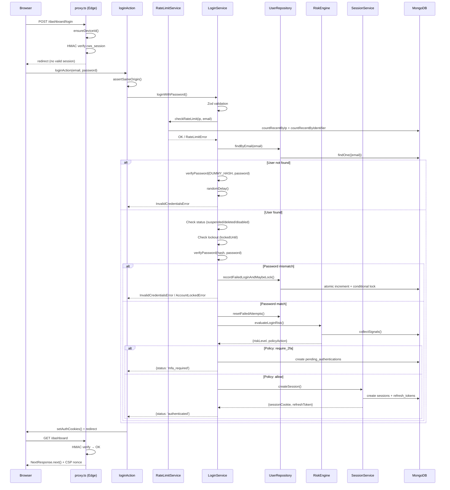

### 6.2 Google Login

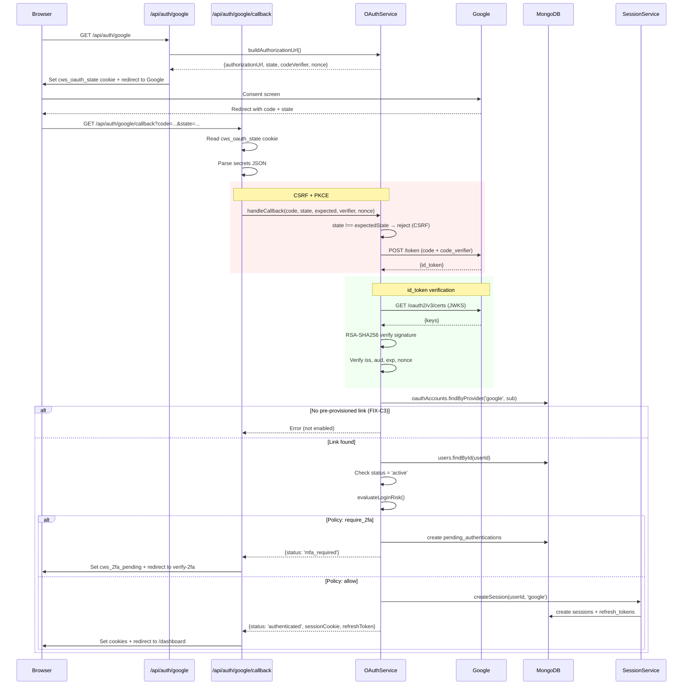

### 6.3 Email OTP Verification (2FA)

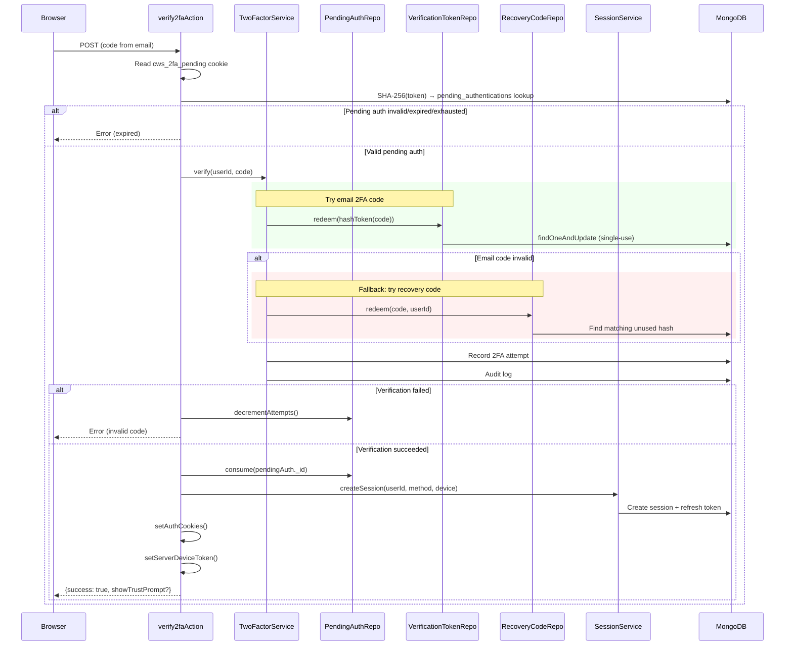

### 6.4 TOTP Login Verification

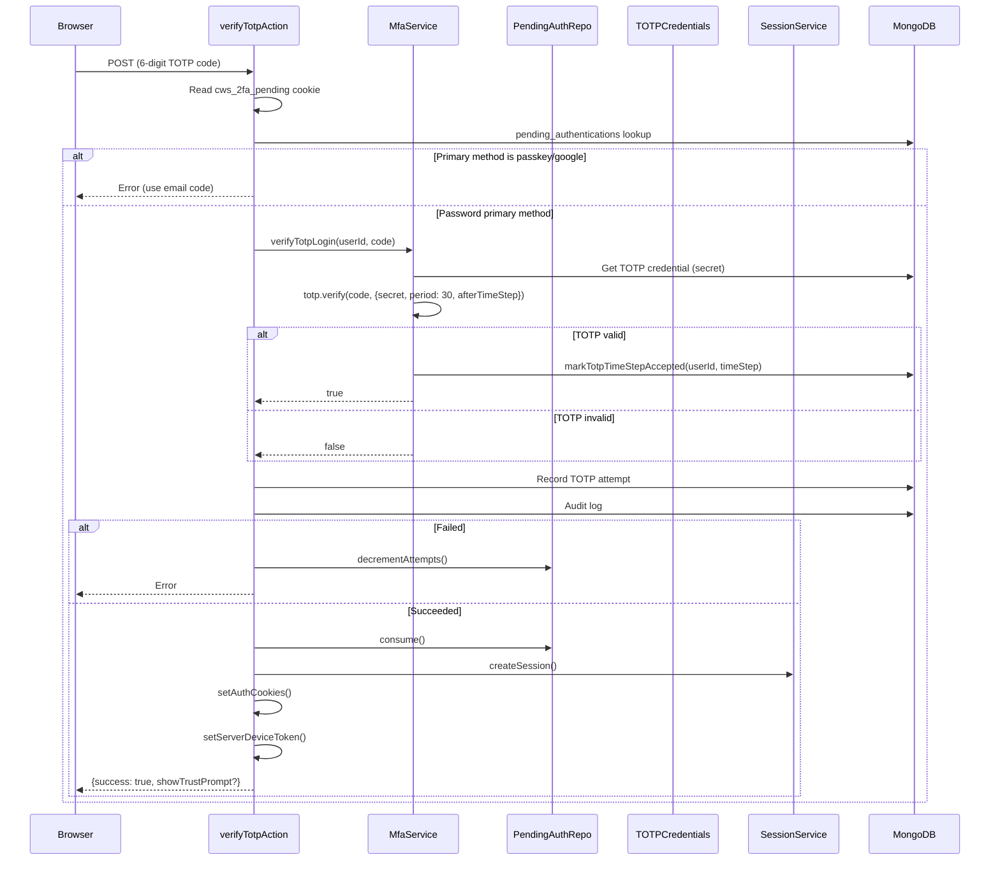

### 6.5 Password Reset

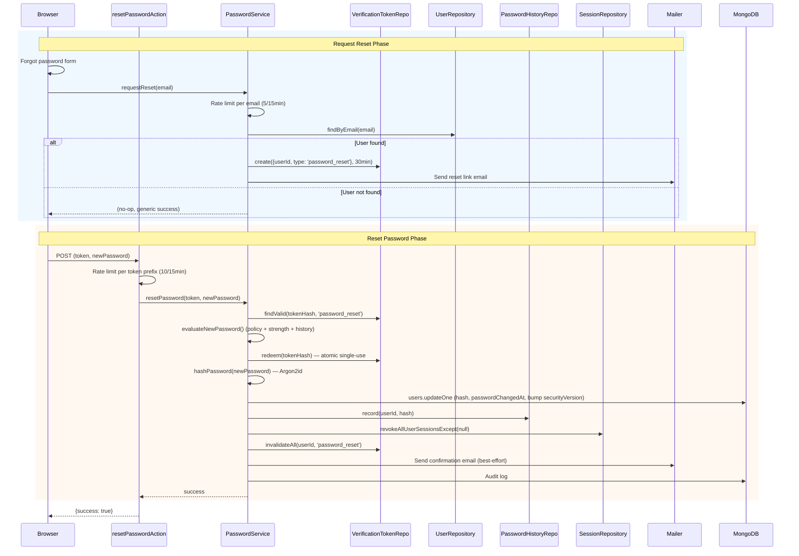

### 6.6 2FA Enrollment (TOTP)

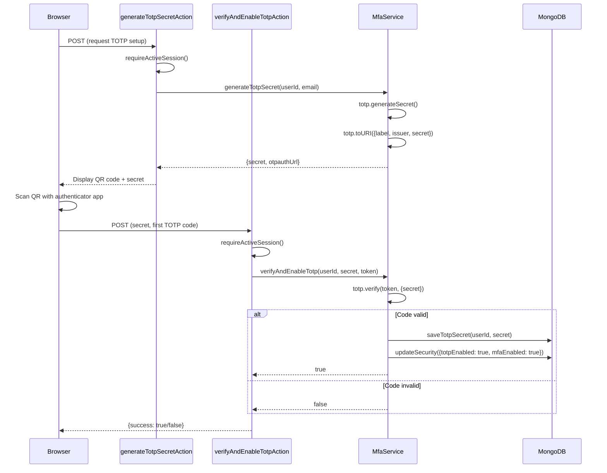

### 6.7 2FA Removal (TOTP Disable)

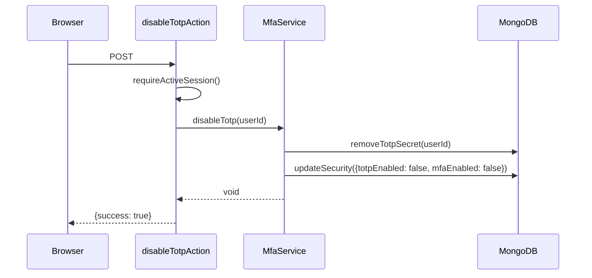

### 6.8 Session Creation and Expiration

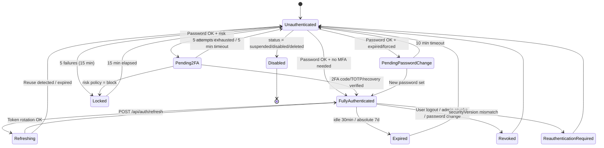

### 6.9 Logout and Session Revocation

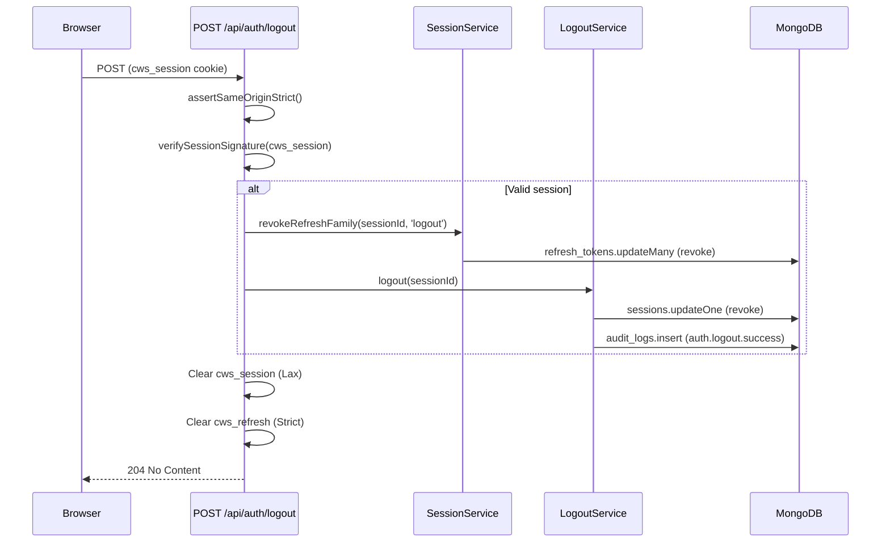

### 6.10 Account Linking (Future — Not Implemented)

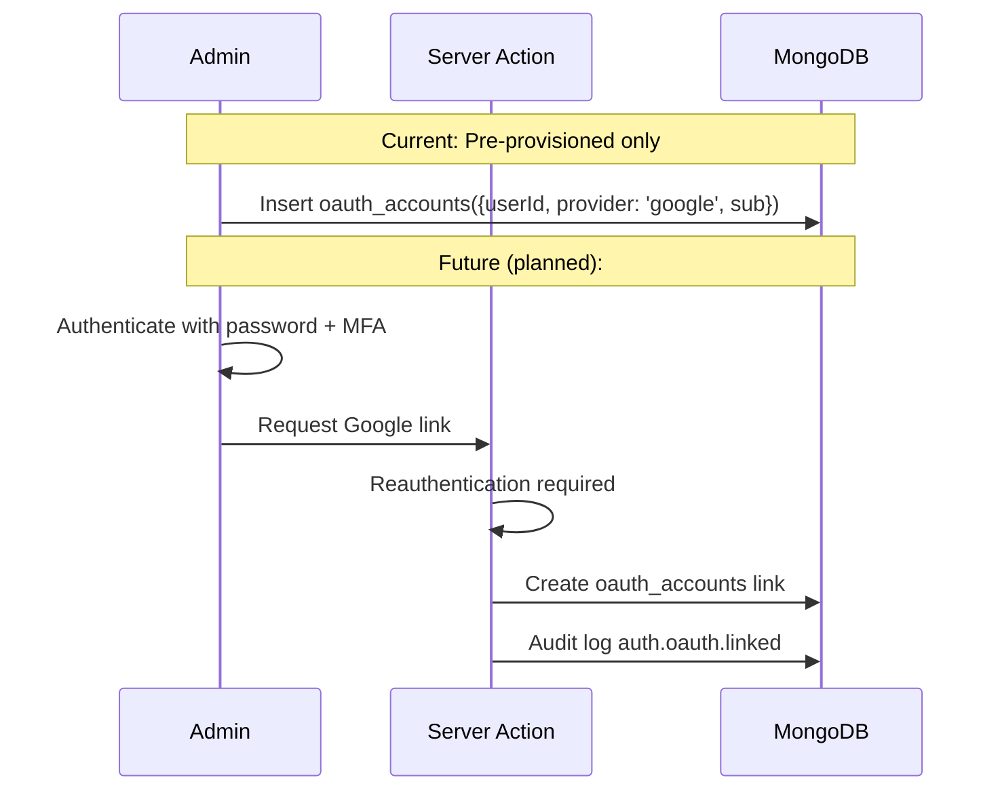

---

## 7. Risk Evaluation Pipeline

### 7.1 Signal Collection

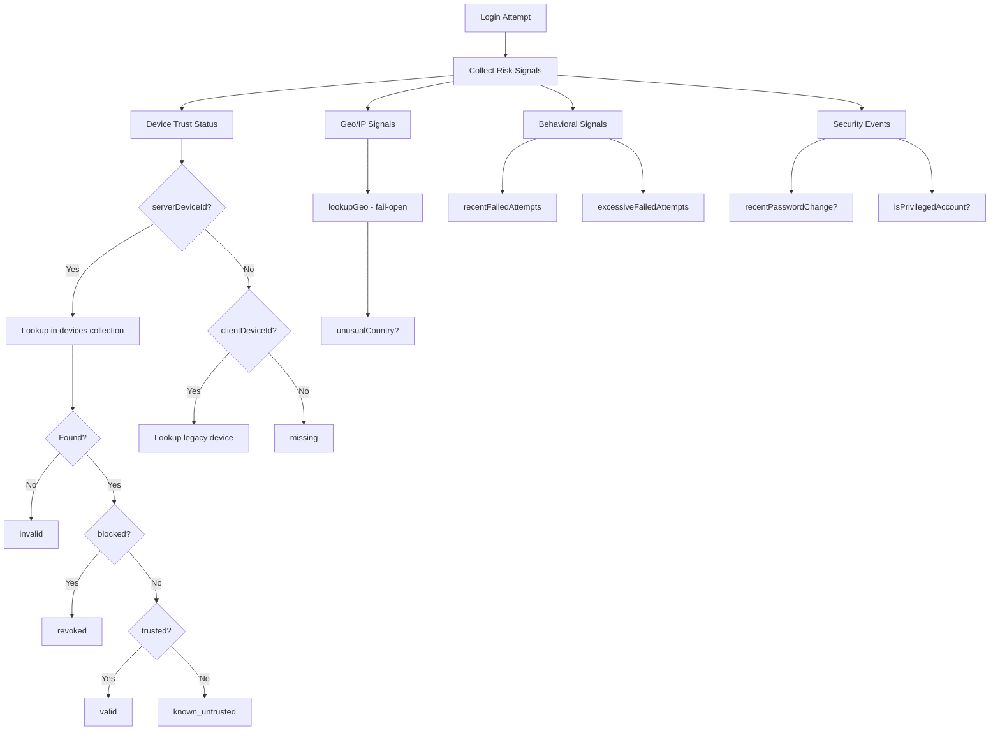

### 7.2 Score Calculation

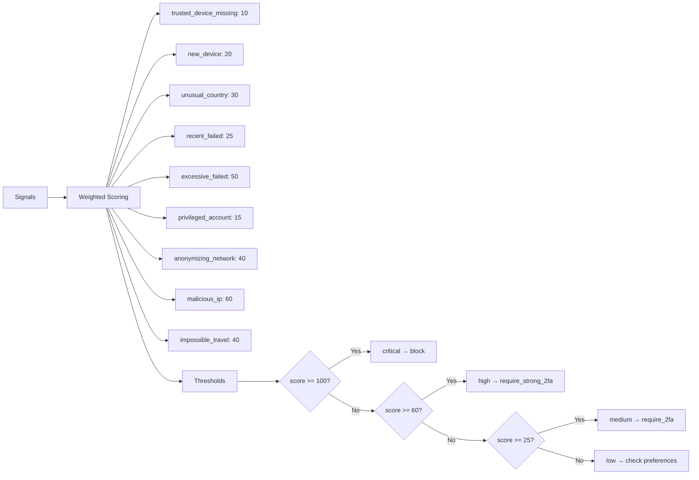

### 7.3 Policy Resolution

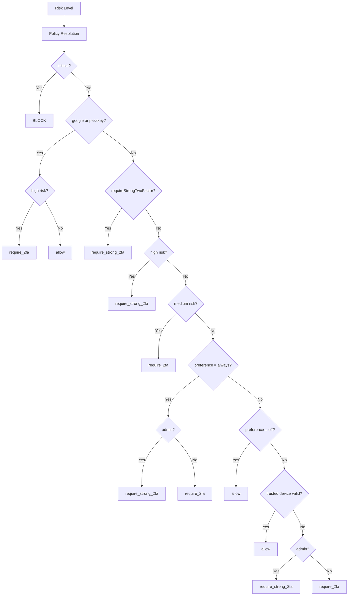

---

## 8. Architectural Risks Summary

### Critical Risks

None identified at the architectural level.

### High-Risk Items

1. **No reauthentication for sensitive actions**: 2FA disable, password change (from active session with known password only — but no step-up MFA), role changes, and account deletion do not require reauthentication. An attacker with an active session can perform these actions.

2. **Role changes do not invalidate sessions**: A demoted user retains their elevated session until expiry. An admin demoted to manager still has admin-level access for up to 15 minutes (or 7 days if actively refreshing).

3. **Account deletion does not revoke sessions**: The `status: 'deleted'` flag will block next DAL validation, but the session remains technically active until then.

### Medium-Risk Items

4. **Debug filesystem writes in production path**: `verify-2fa.ts:125-138` writes `fs.appendFileSync('debug-verify.log', ...)` on every 2FA verification. This leaks internal data and creates a disk-fill DoS vector.

5. **Incomplete risk signal sources**: `isUnusualNetwork`, `isAnonymizingNetwork`, `isMaliciousIp`, `impossibleTravel` are hardcoded to `false`. The risk engine's effectiveness is reduced.

6. **Geo-IP fail-open**: Without `GEOIP_LOOKUP_URL`, country-change detection is inoperative. Only new-device step-up fires.

7. **OAuth callback SameSite mismatch**: The Google callback sets `cws_2fa_pending` with `SameSite: 'lax'`, while the login action sets it with `SameSite: 'strict'`. This inconsistency may allow the cookie to be sent in more contexts than intended.

### Low-Risk Items

8. **Concurrent session limit hardcoded to 5**: Not configurable per-user or per-role.

9. **Proxy HMAC-only check**: `proxy.ts` validates HMAC signature but not DB state. A revoked session passes the edge check and only fails at the DAL layer.

10. **`ensureDeviceId()` errors silently swallowed**: `.catch(() => {})` in proxy means device registration failures are invisible.

11. **Dead code**: `step_up` return status in login action (`login.ts:84-86`) is unreachable.

12. **No explicit passwordless WebAuthn login route**: Passwordless options are built in `MfaService` but not exposed.

### Informational

13. **TOTP replay window not bounded**: `afterTimeStep` prevents immediate replay but the window is determined by otplib defaults.

14. **No email change workflow**: Users cannot self-service change their email.

15. **No Google account linking/unlinking UI**: OAuth accounts must be pre-provisioned in the database.
