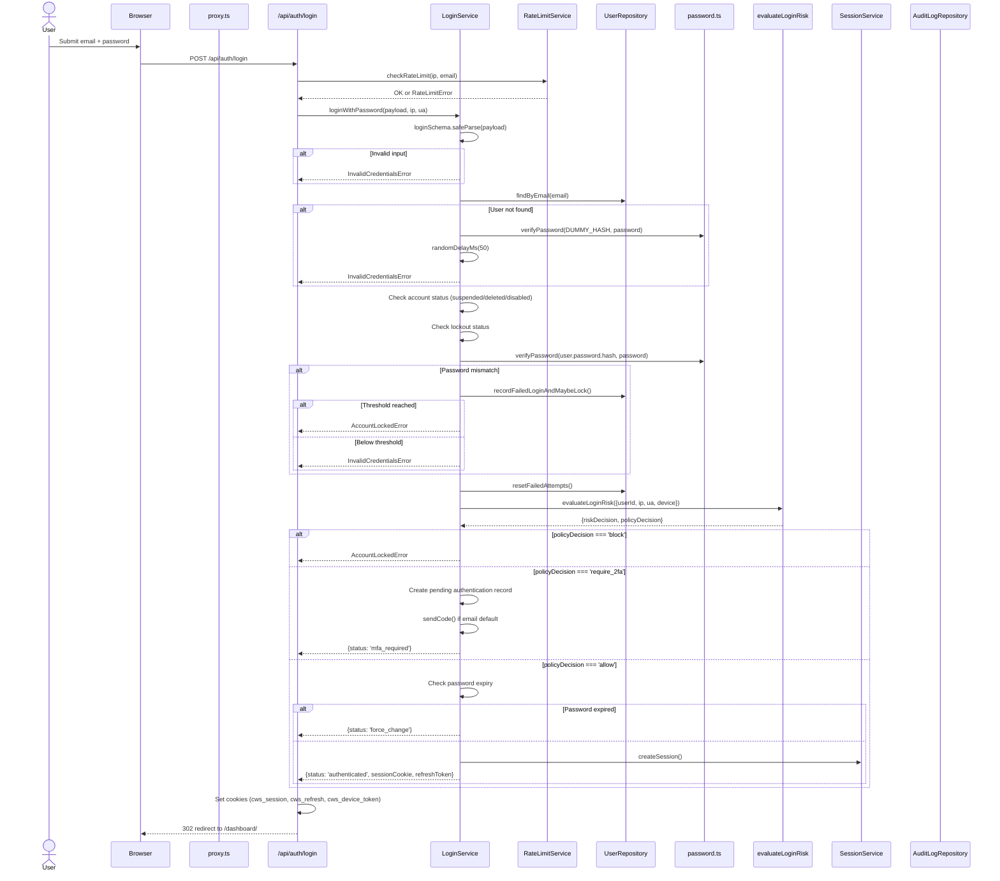
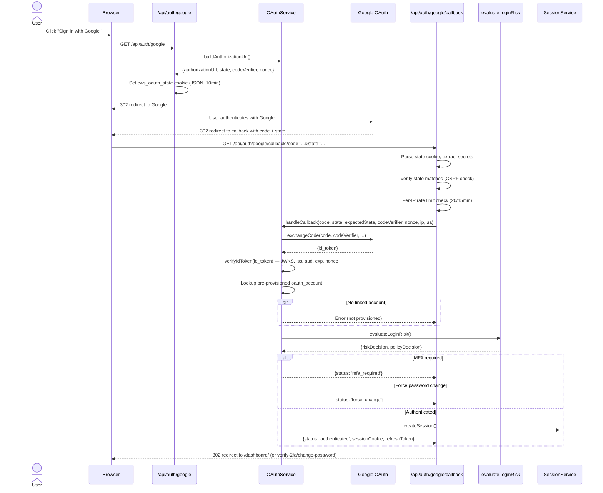
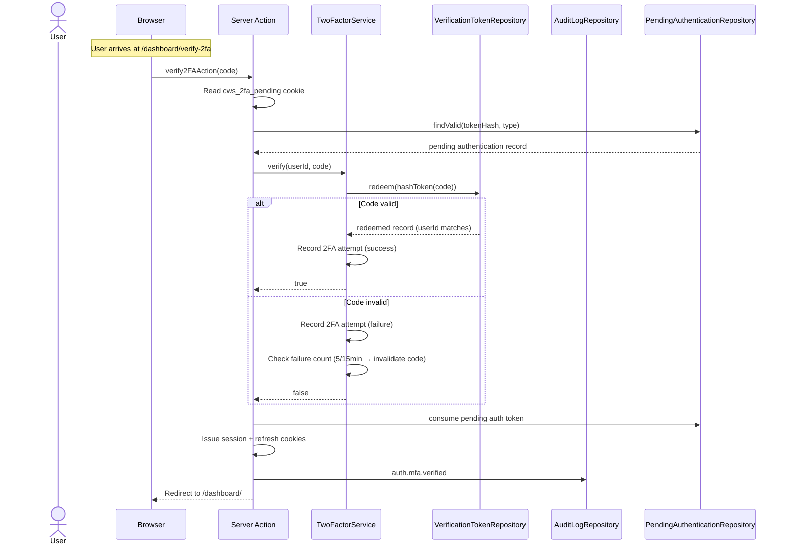
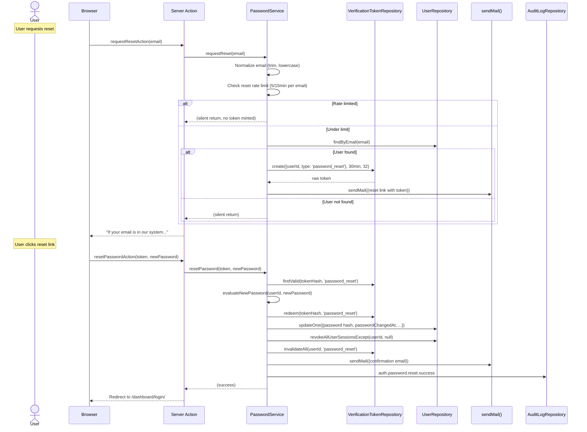
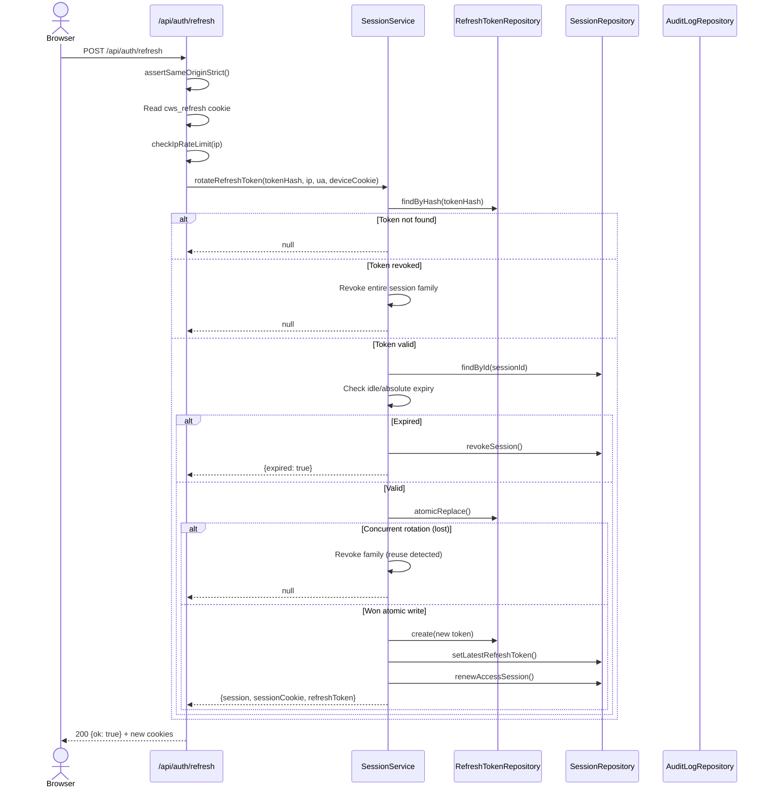
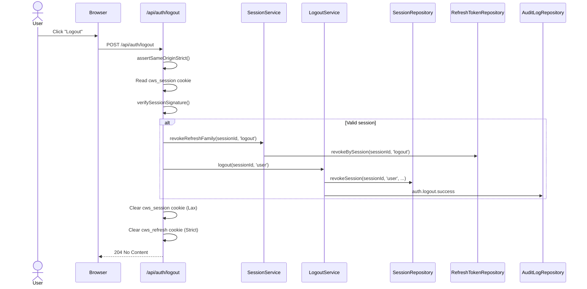

# Current Authentication Workflows

## Workflow 1: Email/Password Login

### Mermaid Diagram

### Entry Point

- **File:** `src/app/api/auth/login/route.ts`
- **Method:** POST
- **CSRF:** `assertSameOriginStrict()` (Route Handler)

### Preconditions

- Request contains `email` and `password` in body
- `rememberMe` is optional boolean

### Steps

1. **Input validation** — `loginSchema.safeParse(payload)` validates email format, password presence, and rememberMe type
2. **Rate limit check** — `RateLimitService.checkRateLimit(ip, email)` checks:
   - Active account lockout in DB
   - IP-based limit: 20 failures / 15min window
   - Identifier-based progressive delay: 5+ failures → exponential backoff (2s, 4s, 8s, ...)
3. **User resolution** — `UserRepository.findByEmail(email)` (email already lowercased by schema)
4. **Unknown email timing mitigation** — If user not found: runs `verifyPassword(DUMMY_HASH, password)` + `randomDelayMs(0-50)` to match the known-user timing profile
5. **Account lifecycle checks** — suspended, deleted, inactive, disabled
6. **Lockout check** — `user.security.lockedUntil > now`
7. **Password verification** — `verifyPassword(hash, password)` (Argon2id, constant-time)
8. **Atomic lockout** — On failure: `recordFailedLoginAndMaybeLock()` atomically increments counter and sets lock if threshold (5) reached
9. **Risk evaluation** — `evaluateLoginRisk()` collects signals, scores risk, resolves 2FA policy
10. **Session creation** — `SessionService.createSession()` generates session + refresh token + device binding
11. **Cookie issuance** — `cws_session` (Lax, rolling), `cws_refresh` (Strict, 7d), `cws_device_token` (Lax, 1yr)
12. **Audit logging** — `auth.login.success` or `auth.login.failure` written to `audit_logs`

### Success State

- Session cookie set (`cws_session`)
- Refresh token cookie set (`cws_refresh`)
- Device token cookie set (`cws_device_token`)
- Redirect to `/dashboard/`
- Audit log entry written

### Failure State

- Generic error message (never reveals which rule failed)
- Failed attempt recorded in `login_attempts` and `audit_logs`
- Alert forwarded to security sink
- Account locked if threshold reached

### Missing/Questionable Controls

- **No CAPTCHA** — Rate limiting is IP + identifier based, but a sophisticated attacker could distribute attempts across IPs
- **IP spoofing mitigation** — `getClientIp()` fails closed in production when `TRUSTED_PROXY_IP_HEADER` is not set, returning `0.0.0.0` sentinel (skip IP rate limit, rely on per-identifier)

---

## Workflow 2: Google OAuth Login

### Mermaid Diagram

### Entry Point (Start)

- **File:** `src/app/api/auth/google/route.ts`
- **Method:** GET
- **CSRF:** N/A (read-only redirect)

### Entry Point (Callback)

- **File:** `src/app/api/auth/google/callback/route.ts`
- **Method:** GET
- **CSRF:** State parameter (CSRF protection via signed cookie)

### Preconditions

- `GOOGLE_CLIENT_ID`, `GOOGLE_CLIENT_SECRET`, `GOOGLE_REDIRECT_URI` configured
- Pre-provisioned `oauth_accounts` row exists for the Google `sub`

### Steps

1. **Authorization URL construction** — PKCE `code_verifier` (48 bytes), `state` (32 bytes), `nonce` (24 bytes) generated via `crypto.randomBytes`
2. **State cookie** — JSON of `{state, codeVerifier, nonce}` stored in `cws_oauth_state` (HttpOnly, Lax, 10min)
3. **Google consent** — User authenticates with Google
4. **Callback receipt** — Code + state extracted from URL params
5. **State verification** — `state !== expectedState` → CSRF error (uses `!==`, not timing-safe)
6. **Per-IP rate limit** — 20 attempts / 15min (MongoDB-backed)
7. **Token exchange** — Code + code_verifier sent to Google token endpoint
8. **id_token verification** — RS256 signature via JWKS, iss/aud/exp/iat/nonce validation
9. **Account resolution** — Pre-provisioned linking only (no auto-link by email)
10. **Risk evaluation** — Same pipeline as password login
11. **Session issuance** — Same as password flow
12. **Cookie settings** — Same as password flow

### Success State

- Session + refresh cookies set
- Redirect to `/dashboard/`

### Failure State

- Generic redirect to `/dashboard/login/?error=oauth_failed`
- Audit log entry (`auth.login.failure` with `AUTH_OAUTH_FAILED`)
- Alert forwarded to security sink

### Missing/Questionable Controls

- **State comparison uses `!==`** — Not timing-safe. Low risk due to 256-bit entropy (64 hex chars), but inconsistent with other comparisons in the codebase (`src/auth/services/oauth.service.ts:248`)
- **Refresh cookie SameSite** — Set to `lax` in callback route, but `strict` in refresh route. See Finding OAUTH-001.

---

## Workflow 3: Email OTP 2FA Verification

### Mermaid Diagram

### Entry Point

- **File:** `src/auth/actions/mfa.ts` (Server Action)
- **CSRF:** `withCsrfGuard()` wrapper

### Preconditions

- `cws_2fa_pending` cookie present (set during login)
- Valid pending authentication record in DB (not consumed, not expired)
- 2FA code sent to user's email

### Steps

1. **Pending auth validation** — Hash cookie value, lookup in `pending_authentications`
2. **Code verification** — `TwoFactorService.verify(userId, code)`:
   - Trim input
   - Hash submitted code with SHA-256
   - Redeem verification token (atomic: find + mark consumed)
   - Verify redeemed token belongs to the user
   - Fallback: try as recovery code (`recovery_codes.redeem()`)
3. **Failure tracking** — Record attempt; invalidate code after 5 failures / 15min
4. **Pending auth consumption** — Mark pending authentication as consumed
5. **Session issuance** — Same as login flow
6. **Audit logging** — `auth.mfa.verified` or `auth.mfa.failed`

### Success State

- Session + refresh cookies issued
- `cws_2fa_pending` cookie cleared
- Redirect to `/dashboard/`

### Failure State

- Error message: "Invalid verification code."
- Attempt recorded
- Code invalidated after threshold

### Security Controls

- 6-digit code → 1M possible values
- 5-minute expiry
- 5-attempt lockout
- Single-use (redeem pattern)
- Hashed in DB (SHA-256 of code)
- Recovery code fallback (also single-use)

---

## Workflow 4: TOTP Verification

### Entry Point

- **File:** `src/auth/services/mfa.service.ts:100-113`
- **Called from:** Server Action after pending auth validation

### Steps

1. **Load TOTP credential** — `MfaRepository.getTotpCredential(userId)` retrieves encrypted secret
2. **Verify code** — `totp.verify(token, {secret, period: 30, afterTimeStep: lastAcceptedTimeStep})`
3. **Replay prevention** — On success, `markTotpTimeStepAccepted(userId, result.timeStep)` records the accepted time step
4. **Return result** — Boolean (success/failure)

### Security Controls

- Secret encrypted at rest via `TOTP_ENCRYPTION_KEY` (AES-256-GCM)
- Time step tracking prevents same-code replay
- Standard 30-second period
- otplib 13.4.1 with NobleCryptoPlugin (noble-hashes)

### Missing/Questionable Controls

- **No configurable clock skew window** — `afterTimeStep` is set but no explicit `window` parameter is passed to `totp.verify()`. The default otplib window is typically ±1, but this should be explicitly configured and documented.

---

## Workflow 5: TOTP Enrollment

### Entry Point

- **File:** `src/auth/services/mfa.service.ts:78-95`

### Steps

1. **Generate secret** — `totp.generateSecret()` (base32 encoded)
2. **Build otpauth URL** — `totp.toURI({label, issuer, secret})`
3. **Return to client** — Secret + URL for QR code generation
4. **Verify first code** — User submits first TOTP code
5. **Enable TOTP** — `MfaRepository.saveTotpSecret()` + `UserRepository.updateSecurity({totpEnabled: true, mfaEnabled: true})`

### Security Controls

- Secret not persisted until first successful verification
- No database write until enrollment is confirmed
- Secret encrypted at rest via `TOTP_ENCRYPTION_KEY`

---

## Workflow 6: Password Reset

### Mermaid Diagram

### Entry Point (Request)

- **File:** `src/auth/actions/password.ts` (Server Action)
- **CSRF:** `withCsrfGuard()` wrapper

### Entry Point (Reset)

- **File:** `src/auth/actions/password.ts` (Server Action)
- **CSRF:** `withCsrfGuard()` wrapper

### Preconditions

- Valid email address for request
- Valid token from email link for reset

### Steps

**Request Flow:**

1. Normalize email (trim, lowercase)
2. Rate limit: 5 reset requests per 15 minutes per email
3. Rate limit: 20 per 15 minutes per IP
4. Record reset request in `login_attempts`
5. If user exists: mint 32-byte token, hash with SHA-256, store with 30min TTL
6. Send email with reset link
7. Return generic "success" message (enumeration resistant)

**Reset Flow:**

1. Hash submitted token, lookup valid record
2. Evaluate new password against policy (length + zxcvbn strength)
3. Reject if matches any of last N stored hashes (history check)
4. Atomically consume token (redeem pattern)
5. Hash new password (Argon2id + pepper)
6. Update user document
7. Revoke ALL active sessions for the user
8. Invalidate all pending password reset tokens
9. Send confirmation email
10. Write audit log

### Security Controls

- 32-byte (256-bit) token entropy
- SHA-256 hash storage (token never stored in plaintext)
- 30-minute expiry
- Atomic single-use enforcement (redeem pattern)
- Rate limiting (5/15min per email, 20/15min per IP)
- Enumeration resistance (always returns generic success)
- Session revocation after reset
- Confirmation email after reset
- Password history check (reject reuse of last N)
- zxcvbn strength evaluation

### Missing/Questionable Controls

- **No IP-based reset rate limit for the reset action itself** — Only the request action is rate-limited per IP. The reset action is protected by token + rate limit, but not by a separate IP-based throttle.

---

## Workflow 7: Password Change (Authenticated)

### Entry Point

- **File:** `src/auth/actions/change-password.ts` (Server Action)
- **CSRF:** `withCsrfGuard()` wrapper

### Preconditions

- Active authenticated session
- Current password provided
- New password provided + confirmation

### Steps

1. **Policy validation** — New password checked against active policy (length + zxcvbn)
2. **History check** — Reject if matches any of last N stored hashes
3. **Current password verification** — `verifyPassword(hash, currentPassword)`
4. **Hash new password** — Argon2id + pepper
5. **Atomic update** — Update password, `passwordChangedAt`, bump `accountSecurityVersion`, clear `forcePasswordChange`
6. **Record to history** — `PasswordHistoryRepository.record()`
7. **Revoke other sessions** — `revokeAllUserSessionsExcept(userId, currentSessionId)`
8. **Invalidate pending tokens** — `invalidateAll(userId, 'password_reset')`
9. **Audit log** — `auth.password.change.success`

### Security Controls

- Current password required (re-authentication)
- Bumps `accountSecurityVersion` → invalidates all other sessions
- Revokes all other active sessions
- Password history enforcement
- zxcvbn strength evaluation with user-context dictionary

---

## Workflow 8: 2FA Disable (Sudo Mode)

### Entry Point

- **File:** `src/auth/actions/mfa.ts` (Server Action)
- **CSRF:** `withCsrfGuard()` wrapper

### Preconditions

- Active authenticated session
- Re-authentication completed (sudo mode verified)
- TOTP currently enabled

### Steps

1. Verify sudo mode (re-authentication confirmed)
2. Call `MfaService.disableTotp(userId)`
3. Remove TOTP secret from `mfa_credentials`
4. Update `security.totpEnabled = false`, `security.mfaEnabled = false` (if no other MFA methods)

### Security Controls

- Requires re-authentication (sudo mode)
- Only accessible to authenticated users
- If WebAuthn is also enabled, `mfaEnabled` remains true

---

## Workflow 9: Session Refresh

### Mermaid Diagram

### Entry Point

- **File:** `src/app/api/auth/refresh/route.ts`
- **Method:** POST
- **CSRF:** `assertSameOriginStrict()` (Route Handler)

### Preconditions

- `cws_refresh` cookie present
- `cws_device_token` cookie present (if session is device-bound)

### Steps

1. **CSRF check** — `assertSameOriginStrict()` (must have Origin or Referer matching APP_URL)
2. **IP rate limit** — `checkIpRateLimit(ip)`
3. **Token hash** — `hashToken(refreshCookie.value)` (SHA-256)
4. **Lookup** — Find refresh token by hash
5. **Reuse detection** — If token is revoked → revoke entire session family, alert user
6. **Device binding** — If session has `deviceId`, verify `cws_device_token` matches
7. **Expiry check** — Idle (30min) + absolute (7d) enforced at refresh time
8. **Atomic rotation** — `atomicReplace()` ensures only one concurrent rotation wins
9. **New token issuance** — Create new refresh token, chain to previous
10. **Access session renewal** — Roll `expiresAt` forward (now + 15min)
11. **Cookie updates** — New `cws_session` + `cws_refresh` cookies

### Security Controls

- Timing-safe token comparison (SHA-256 hash)
- Atomic rotation prevents double-spend
- Reuse detection triggers family revocation + alert
- Device binding prevents cross-device token use
- Idle + absolute timeout enforcement
- Origin/CSRF guard
- IP rate limiting

---

## Workflow 10: Logout and Session Revocation

### Mermaid Diagram

### Entry Point

- **File:** `src/app/api/auth/logout/route.ts`
- **Method:** POST
- **CSRF:** `assertSameOriginStrict()` (Route Handler)

### Preconditions

- Active session (cookie present)

### Steps

1. **CSRF check** — `assertSameOriginStrict()`
2. **Session verification** — `verifySessionSignature(cookieValue, SESSION_SECRET)`
3. **Refresh family revocation** — `SessionService.revokeRefreshFamily(sessionId, 'logout')` — revokes all refresh tokens for this session
4. **Session revocation** — `LogoutService.logout(sessionId, 'user')` — marks session as revoked
5. **Audit log** — `auth.logout.success`
6. **Cookie clearing** — Both `cws_session` (Lax) and `cws_refresh` (Strict) cleared with matching SameSite

### Security Controls

- Refresh family revoked FIRST (so a stolen refresh cannot re-auth before the session is revoked)
- Both cookies cleared
- Audit log written
- CSRF protection on the endpoint
- No client-side JavaScript can trigger logout via GET (POST only)
